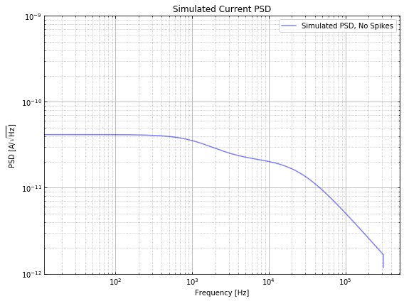
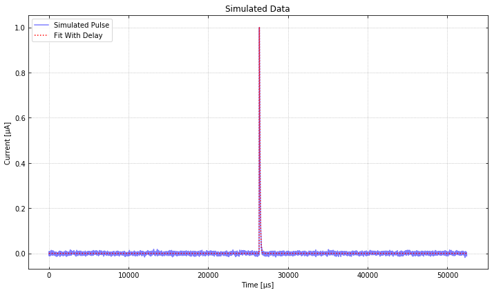
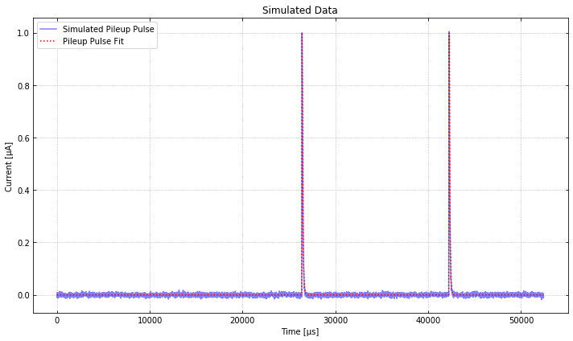
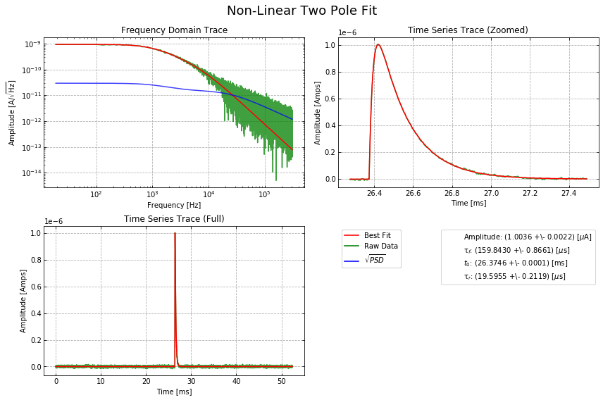

# Example Code for the Optimum Filters
--------------------------------------

Import ``qetpy`` and other necessary packages.

.. code:: ipython3

    import numpy as np
    import matplotlib.pyplot as plt
    import qetpy as qp
    from pprint import pprint

Use ``QETpy`` to generate some simulated TES noise
--------------------------------------------------

We can use ``qetpy.sim.TESnoise`` to help create a simulated PSD with
characteristic TES parameters.

.. code:: ipython3

    fs = 625e3
    f = np.fft.fftfreq(32768, d=1/fs)
    noisesim = qp.sim.TESnoise(r0=0.03)
    psd_sim = noisesim.s_iload(freqs=f) + noisesim.s_ites(freqs=f) + noisesim.s_itfn(freqs=f)
    
    f_fold, psd_sim_fold = qp.foldpsd(psd_sim, fs=fs)

.. code:: ipython3

    fig, ax = plt.subplots(figsize=(8, 6))
    ax.loglog(f_fold, psd_sim_fold**0.5, color="blue", alpha=0.5, label="Simulated PSD, No Spikes")
    ax.set_ylim(1e-12,1e-9)
    ax.grid()
    ax.grid(which="minor", linestyle="dotted")
    ax.tick_params(which="both", direction="in", right=True, top=True)
    ax.legend(loc="best")
    ax.set_title("Simulated Current PSD")
    ax.set_ylabel("PSD [A/$\sqrt{\mathrm{Hz}}$]")
    ax.set_xlabel("Frequency [Hz]")
    fig.tight_layout()

With a PSD, we can use ``qetpy.gen_noise`` to generate random noise from
the PSD (assuming the frequencies are uncorrelated). Then, we will
create an example pulse.

.. code:: ipython3

    # create a template
    pulse_amp = 1e-6 # [A]
    tau_f = 66e-6 # [s]
    tau_r = 20e-6 # [s]
    
    t = np.arange(len(psd_sim))/fs
    
    pulse = np.exp(-t/tau_f)-np.exp(-t/tau_r)
    pulse_shifted = np.roll(pulse, len(t)//2)
    template = pulse_shifted/pulse_shifted.max()
    
    # use the PSD to create an example trace to fit
    noise = qp.gen_noise(psd_sim, fs=fs, ntraces=1)[0]
    signal = noise + np.roll(template, 100)*pulse_amp # note the shift we have added, 160 us

Fit a single pulse with ``OptimumFilter``
-----------------------------------------

With a pulse created, let's use the ``qetpy.OptimumFilter`` class to run
different Optimum Filters.

.. code:: ipython3

    qp.OptimumFilter?

Below, we print the different methods available in
``qetpy.OptimumFilter``. In this notebook, we will demo the
``ofamp_nodelay``, ``ofamp_withdelay``, ``ofamp_pileup_iterative``, and
``update_signal`` methods. It is highly recommend to read the
documentation for the other methods, as there are many useful ones!

.. code:: ipython3

    method_list = sorted([func for func in dir(qp.OptimumFilter) if callable(getattr(qp.OptimumFilter, func)) and not func.startswith("__")])
    pprint(method_list)

.. parsed-literal::

    ['chi2_lowfreq',
     'chi2_nopulse',
     'energy_resolution',
     'ofamp_baseline',
     'ofamp_nodelay',
     'ofamp_pileup_iterative',
     'ofamp_pileup_stationary',
     'ofamp_withdelay',
     'time_resolution',
     'update_signal']

Let's run the Optimum Filter without and with a time-shifting degree of
freedom.

.. code:: ipython3

    OF = qp.OptimumFilter(signal, template, psd_sim, fs) # initialize the OptimumFilter class
    amp_nodelay, chi2_nodelay = OF.ofamp_nodelay()
    amp_withdelay, t0_withdelay, chi2_withdelay = OF.ofamp_withdelay()
    
    print(f"No Delay Fit: amp = {amp_nodelay*1e6:.2f} μA, χ^2 = {chi2_nodelay:.2f}")
    print(f"With Delay Fit: amp = {amp_withdelay*1e6:.2f} μA, t_0 = {t0_withdelay*1e6} μs, χ^2 = {chi2_withdelay:.2f}")

.. parsed-literal::

    No Delay Fit: amp = -0.04 μA, χ^2 = 210399.75
    With Delay Fit: amp = 1.00 μA, t_0 = 160.0 μs, χ^2 = 32407.30

Since we have added a 160 us shift, we see that the "with delay" optimum
filter fit the time-shift perfectly, and the chi-squared is very close
to the number of degrees of freedom (32768), as we would expect for a
good fit.

.. code:: ipython3

    fig, ax = plt.subplots(figsize=(10, 6))
    ax.plot(t*1e6, signal*1e6, label="Simulated Pulse", color="blue", alpha=0.5)
    ax.plot(t*1e6, amp_withdelay*np.roll(template, int(t0_withdelay*fs))*1e6, 
            label="Fit With Delay", color="red", linestyle="dotted")
    ax.set_ylabel("Current [μA]")
    ax.set_xlabel("Time [μs]")
    ax.set_title("Simulated Data")
    lgd = ax.legend(loc="upper left")
    ax.tick_params(which="both", direction="in", right=True, top=True)
    ax.grid(linestyle="dotted")
    fig.tight_layout()

Add a pileup pulse and fit with ``OptimumFilter``
-------------------------------------------------

Let's now add a second (pileup) pulse in order to see how we can use
``ofamp_pileup_iterative``.

.. code:: ipython3

    pileup = signal + np.roll(template, 10000)*pulse_amp
    
    OF.update_signal(pileup) # update the signal in order to fit a new trace
    amp_withdelay, t0_withdelay, chi2_withdelay = OF.ofamp_withdelay(nconstrain=300)
    amp_pileup, t0_pileup, chi2_pileup = OF.ofamp_pileup_iterative(amp_withdelay, t0_withdelay)
    
    print(f"With Delay Fit: amp = {amp_withdelay*1e6:.2f} μA, t_0 = {t0_withdelay*1e6} μs, χ^2 = {chi2_withdelay:.2f}")
    print(f"Pileup Fit: amp = {amp_pileup*1e6:.2f} μA, t_0 = {t0_pileup*1e6} μs, χ^2 = {chi2_pileup:.2f}")

.. parsed-literal::

    With Delay Fit: amp = 1.00 μA, t_0 = 160.0 μs, χ^2 = 209503.04
    Pileup Fit: amp = 1.00 μA, t_0 = 16000.0 μs, χ^2 = 32407.28

As expected, the pileup optimum filter fit the data very well, as we can
see from the chi-squared above.

.. code:: ipython3

    fig, ax = plt.subplots(figsize=(10, 6))
    
    ax.plot(t*1e6, pileup*1e6, label="Simulated Pileup Pulse", color="blue", alpha=0.5)
    ax.plot(t*1e6, amp_withdelay*np.roll(template, int(t0_withdelay*fs))*1e6 + \
            amp_pileup*np.roll(template, int(t0_pileup*fs))*1e6, 
            label="Pileup Pulse Fit", color="red", linestyle="dotted")
    
    ax.set_ylabel("Current [μA]")
    ax.set_xlabel("Time [μs]")
    ax.set_title("Simulated Data")
    lgd = ax.legend(loc="upper left")
    ax.tick_params(which="both", direction="in", right=True, top=True)
    ax.grid(linestyle="dotted")
    fig.tight_layout()

Nonlinear Fitting
-----------------

What about when we do not have a template? The ``qetpy.OFnonlin`` class
has been written to fit the fall times as well, which is useful for
cases where we do not have a template, or we know that the template will
not match the data well.

.. code:: ipython3

    pulse_amp = 1e-6
    tau_f = 160e-6
    tau_r = 20e-6
    
    t = np.arange(len(psd_sim))/fs
    
    pulse = np.exp(-t/tau_f)-np.exp(-t/tau_r)
    pulse_shifted = np.roll(pulse, len(t)//2)
    template = pulse_shifted/pulse_shifted.max()
    
    noise = qp.gen_noise(psd_sim, fs=fs, ntraces=1)[0]
    signal = noise + np.roll(template, 100)*pulse_amp

We can try using our "bad" template (with a 66 us fall time), but we
will see that the chi-squared indicates a non-ideal fit.

.. code:: ipython3

    OF.update_signal(signal) # update the signal in order to fit a new trace
    amp_withdelay, t0_withdelay, chi2_withdelay = OF.ofamp_withdelay(nconstrain=300)
    
    print(f"With Delay Fit: amp = {amp_withdelay*1e6:.2f} μA, t_0 = {t0_withdelay*1e6:.2f} μs, χ^2 = {chi2_withdelay:.2f}")

.. parsed-literal::

    With Delay Fit: amp = 1.07 μA, t_0 = 163.20 μs, χ^2 = 72524.20

Let's use ``qetpy.OFnonlin`` to do the fit. To help visualize the fit,
we will use the parameter ``lgcplot=True`` to plot the fit in frequency
domain and time domain

.. code:: ipython3

    qp.OFnonlin?

.. code:: ipython3

    qp.OFnonlin.fit_falltimes?

.. code:: ipython3

    nonlinof = qp.OFnonlin(psd_sim, fs, template=None)
    params, error, _, chi2_nonlin, success = nonlinof.fit_falltimes(signal, npolefit=2, lgcfullrtn=True, lgcplot=True)

.. code:: ipython3

    print(f"Nonlinear fit: χ^2 = {chi2_nonlin * (len(nonlinof.data)-nonlinof.dof):.2f}")

.. parsed-literal::

    Nonlinear fit: χ^2 = 32719.95

And we see that the fit using ``qetpy.OFnonlin`` is great! The
chi-squared is near the number of degrees of freedom (32768), which
indicates that we have a good fit.

For further documentation on the different fitting functions, please
visit
https://qetpy.readthedocs.io/en/latest/qetpy.core.html#module-qetpy.core.\_fitting.

