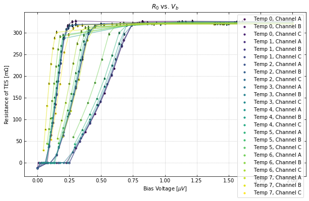
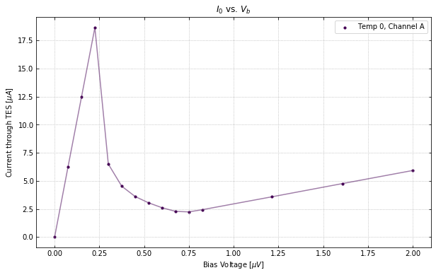
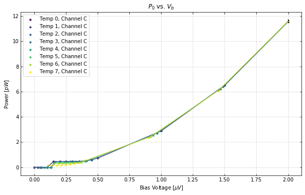

.. raw:: html

   <h1>

Table of Contents

.. raw:: html

   </h1>
   
<ul class="toc-item"></ul>

Example Code for using the IV class
===================================

Import the need packages to run the test script

.. code:: ipython3

    import numpy as np
    from qetpy import IV

Let's load the example data provided, which is from a dataset taken at
SLAC for multiple devices and multiple bath temperatures.

.. code:: ipython3

    testdata = np.load("test_iv_data.npz")
    dites = testdata["dites"]
    dites_err = testdata["dites_err"]
    vb = testdata["vb"]
    vb_err = testdata["vb_err"]
    rload = testdata["rload"]
    rload_err = testdata["rload_err"]

Now let's use the IV class and calculate the IV curves

.. code:: ipython3

    ivdata = IV(dites, dites_err, vb, vb_err, rload, rload_err, ["A","B","C"])
    ivdata.calc_iv()

Let's take a look at the plotting. We can plot all of the curves
together.

.. code:: ipython3

    ivdata.plot_all_curves()

.. image:: iv_class_test_files/iv_class_test_9_0.png

.. image:: iv_class_test_files/iv_class_test_9_2.png

If you want to plot certain channels or certain bath temperatures, use
the chans and temps flags.

.. code:: ipython3

    ivdata.plot_all_curves(temps=[0,7], chans=1)

.. image:: iv_class_test_files/iv_class_test_11_0.png

.. image:: iv_class_test_files/iv_class_test_11_1.png

.. image:: iv_class_test_files/iv_class_test_11_2.png

We can also plot the IV, resistance, and power curves separately. See
the documentation for more information on the plotting options.

.. code:: ipython3

    ivdata.plot_iv(temps=0, chans=0, showfit=False);
    ivdata.plot_rv(temps=[0,-1], chans=[0,1]);
    ivdata.plot_pv(temps="all", chans=2);

.. image:: iv_class_test_files/iv_class_test_13_1.png

