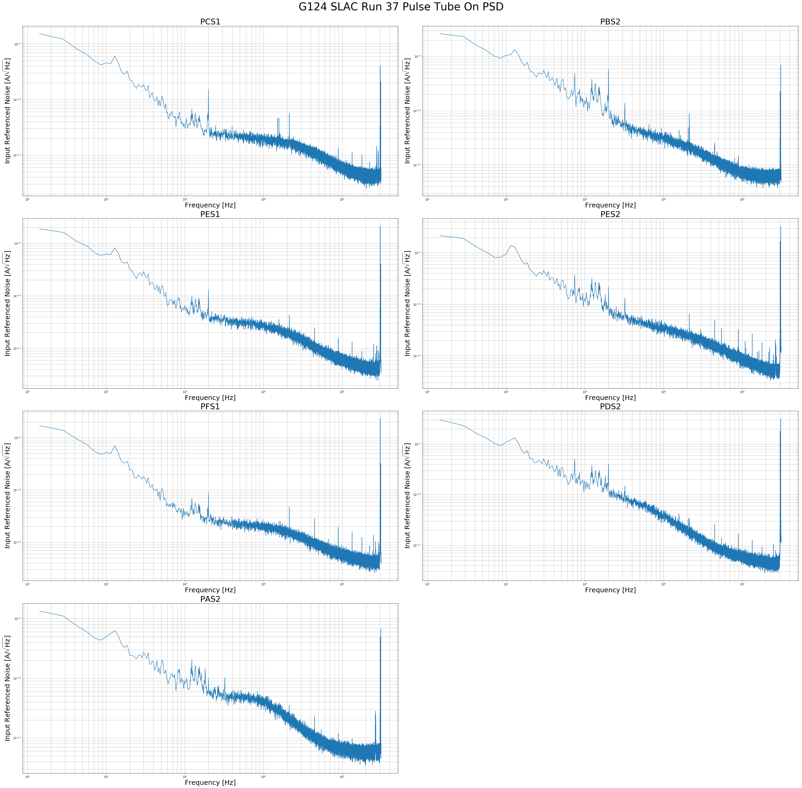
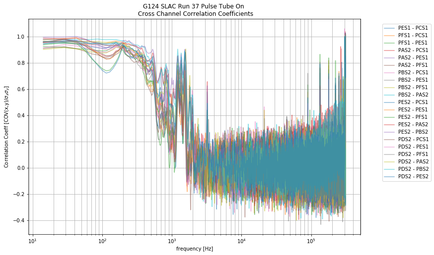
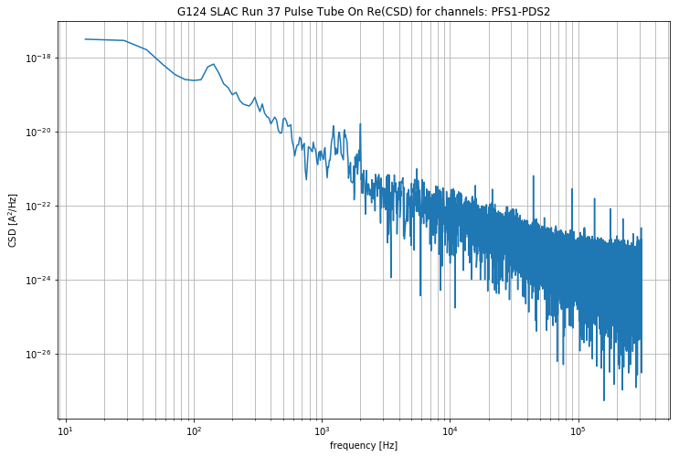
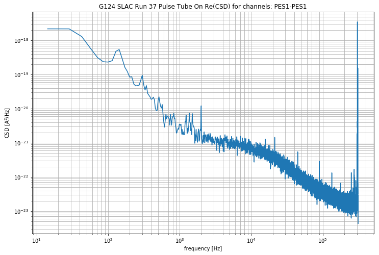
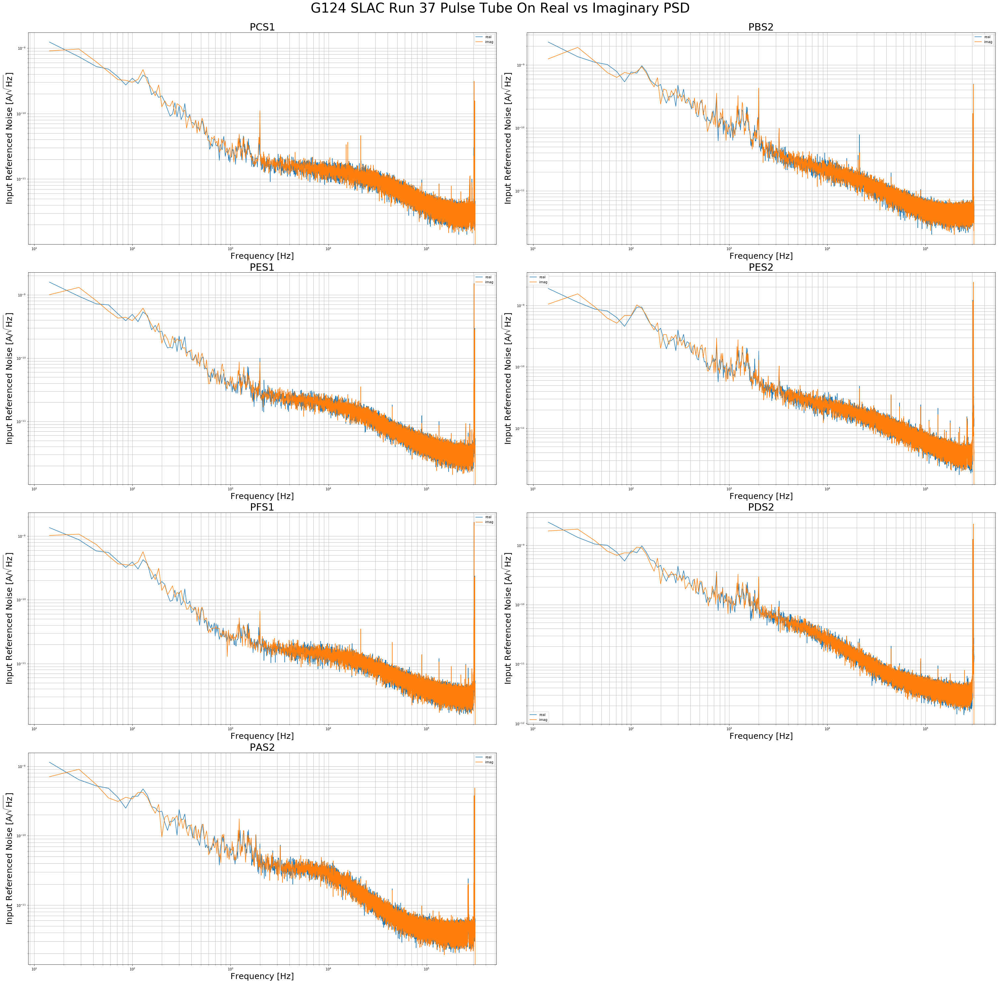
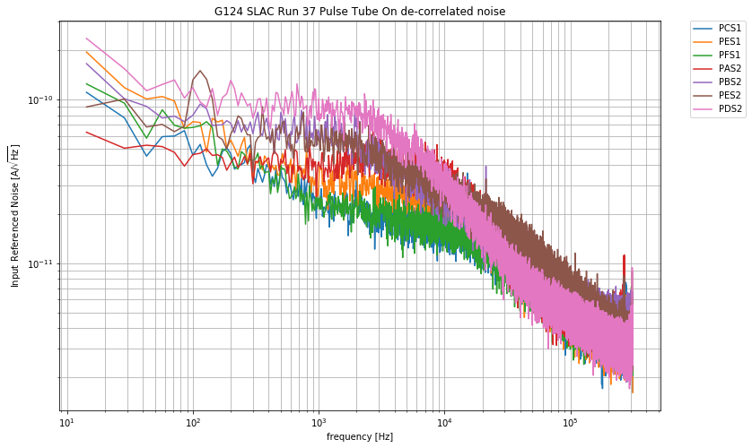
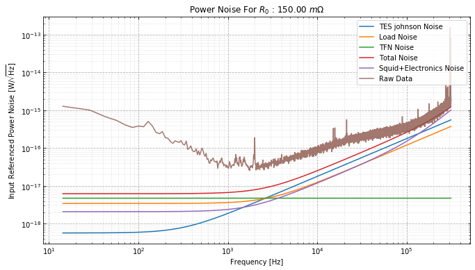

.. raw:: html

   <h1>

Table of Contents

.. raw:: html

   </h1>

.. raw:: html

   

.. raw:: html

   <ul class="toc-item">

.. raw:: html

   </ul>

.. raw:: html

   

Noise Analysis Test
===================

Imports

.. code:: ipython3

    from qetpy import Noise
    from qetpy.sim import TESnoise
    from qetpy.plotting import compare_noise, plot_noise_sim
    import numpy as np
    import matplotlib.pyplot as plt

Load test data

.. code:: ipython3

    pathToTraces = ''
    traces_PT_on = np.load(pathToTraces+'traces.npy')

Create noise object

.. code:: ipython3

    Noise?

.. code:: ipython3

    #savePath = 'example_Figs/' #used for test, user should define new path for test so they don't save over these figs
    savePath = '' #user needs to define new path
    
    fs = 625e3 #define sample rate
    channels = [ 'PCS1' , 'PES1' , 'PFS1' , 'PAS2' , 'PBS2' , 'PES2' , 'PDS2' ] #define the channel names
    g124_noise = Noise(traces=traces_PT_on,
                       fs=fs, 
                       channames=channels,
                       name= 'G124 SLAC Run 37 Pulse Tube On') #initialize a noise object
    
    

Calculate the PSD and corrCoeff

.. code:: ipython3

    g124_noise.calculate_psd()
    g124_noise.calculate_corrcoeff()
    g124_noise.calculate_csd()
    

Calculate unCorrelated noise

.. code:: ipython3

    g124_noise.calculate_uncorr_noise()

Test saving.

Uncomment to save and re-load

.. code:: ipython3

    #saveName = pathToTraces + g124_noise.name.replace(" ", "_") + '.pkl'
    #g124_noise.save(pathToTraces)

.. code:: ipython3

    #del g124_noise

.. code:: ipython3

    # with open(pathToTraces,'rb') as savefile:
    #     g124_noise = pickle.load(savefile)

Test plotting of PSD and corrCoeff

.. code:: ipython3

    g124_noise.plot_psd(lgcoverlay=True)

.. code:: ipython3

    
    g124_noise.plot_psd(lgcoverlay=False)

.. image:: noise_example_files/noise_example_19_0.png

.. code:: ipython3

    g124_noise.plot_corrcoeff(lgcsave=False, lgcsmooth=True, nwindow=13 )

Plot a few CSDs

.. code:: ipython3

    g124_noise.plot_csd(whichcsd=['66','26'])

.. image:: noise_example_files/noise_example_22_0.png

Try to plot a CSD for a non existant channel

.. code:: ipython3

    g124_noise.plot_csd(whichcsd=['68'])

.. parsed-literal::

    index out of range

Try to save a figure with a bad path

.. code:: ipython3

    g124_noise.plot_csd(whichcsd=['11'], lgcsave=True, savepath = 'yay/python/is/great')

.. parsed-literal::

    Invalid save path. Figure not saved

Plot Real vs Imaginary PSDs

.. code:: ipython3

    g124_noise.plot_reim_psd()

Plot unCorrelated part of the noise PSD

.. code:: ipython3

    g124_noise.calculate_uncorr_noise()

.. code:: ipython3

    
    g124_noise.plot_decorrelatednoise(lgccorrelated=True,lgcsum = True, lgcsave=False)

.. image:: noise_example_files/noise_example_31_0.png

.. code:: ipython3

    g124_noise.plot_decorrelatednoise(lgcoverlay = True)

Create noise simulation object

.. code:: ipython3

    
    noise_sim = TESnoise(freqs = g124_noise.freqs[1:])

Note, these default noise parameters are completely made up, just for
demostration

.. code:: ipython3

    plot_noise_sim(g124_noise.freqs, g124_noise.psd[0,:], noise_sim, istype='power')

.. parsed-literal::

    (<Figure size 864x576 with 1 Axes>,
     <matplotlib.axes._subplots.AxesSubplot at 0x7f8e4b5a4908>)

