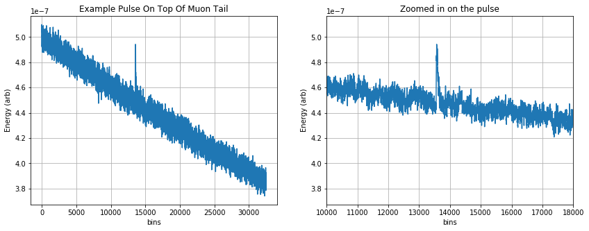
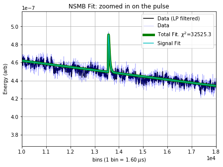
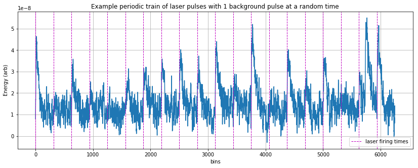
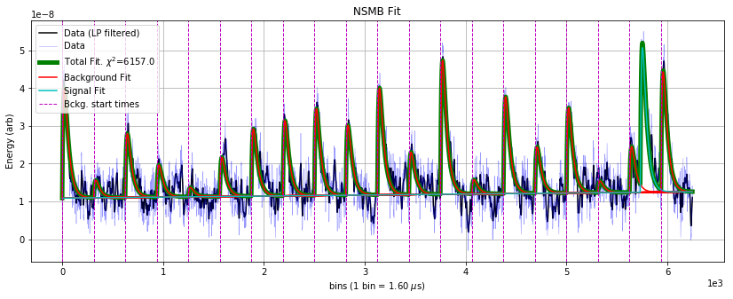
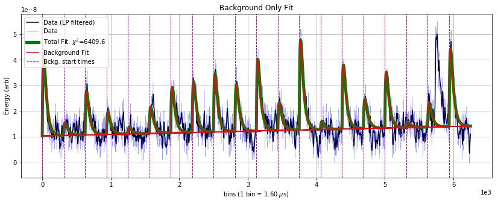

NSMB Optimal Filter
===================

### Multi-template OF Fit with One Time Shift Degree of Freedom Between Templates
---------------------------------------------------------------------------------

Bill Page

Date: 190205

This fit is called the "NSMB Optimal Filter" because it fits amplitudes
for:

-  N signal templates that are allowed to time shift anywhere in the
   trace
-  M background templates that are fixed in time.

It was first written by Matt Pyle to subtract off effects of muons from
test facility data. It has been resurrected for a different application:
fitting background pileup events in the presence of laser-triggered
events with known start times. This new application has required some
tweaks to the fit. This notebook describes the general algorithm and the
things I've added to it.

.. code:: ipython3

    import numpy as np
    import qetpy as qp
    import matplotlib.pyplot as plt

Before getting into how this fit is performed, we motivate it with a few
use cases:

1) Fitting out contamination from muons in surface test facility data:
~~~~~~~~~~~~~~~~~~~~~~~~~~~~~~~~~~~~~~~~~~~~~~~~~~~~~~~~~~~~~~~~~~~~~~

At a test facility this fit will help remove pulses from background
particles and long thermal muon tails from the data. In the example
below we simulate example data with a pulse randomly spaced in time as
well as a muon tail (a long fall time exponential feature across the
trace).

Then we perform the NSMB fit where the free parameters in the are: \*
the amplitude of the pulse \* the time delay of the pulse \* the
amplitude of the DC component \* the amplitude of the muon tail (slope)
component

.. code:: ipython3

    # create noise + fake pulse + muon tail, also outputting template for pulse and psd for noise
    signal, template, psd = qp.sim._sim_nsmb.create_example_pulseplusmuontail()
    signal = (-1)*signal # flip polarity for positive going pulse
    
    plt.figure(figsize=(14,5));
    plt.subplot(1,2,1)
    plt.plot(signal, '-');
    plt.xlabel('bins')
    plt.ylabel('Energy (arb)')
    plt.title('Example Pulse On Top Of Muon Tail')
    plt.grid()
    plt.subplot(1,2,2)
    plt.plot(signal,'-')
    plt.xlim([10000, 18000])
    plt.xlabel('bins')
    plt.ylabel('Energy (arb)')
    plt.title('Zoomed in on the pulse')
    plt.grid()

.. code:: ipython3

    nbin = len(signal)
    
    # construct the background templates which are just a slope and a baseline
    backgroundtemplates, backgroundtemplatesshifts = qp.core._of_nsmb.get_slope_dc_template_nsmb(nbin)
    
    # setup the NSMB
    fs = 625e3 # example sample rate
    (psddnu,phi,Pfs, P, sbtemplatef,
     sbtemplatet,iB,B,ns,nb,bitcomb,lfindex)  = qp.of_nsmb_setup(template,backgroundtemplates,psd, fs)
    
    # invert the P matrix -- see below if interested in this
    iP = qp.of_nsmb_getiP(P)    
    
    # give bin window over which to look for signal
    indwindow = np.arange(0,len(template))
    
    # put the window into a list (can have multiple list elements)
    indwindow_nsmb = [indwindow[:,None].T]
    
    lgcplotnsmb = True
    (amps_nsmb, t0_s_nsmb, chi2_nsmb,
    chi2_nsmb_lf,resid) = qp.of_nsmb(signal,
                                    phi, 
                                    sbtemplatef.T, 
                                    sbtemplatet, iP, 
                                    psddnu.T, fs, 
                                    indwindow_nsmb, ns, nb, 
                                    bitcomb, lfindex, 
                                    lgcplot=lgcplotnsmb,lgcsaveplots=False)
    fig = plt.gcf()
    fig.set_size_inches(7,5)
    plt.xlim([10000, 18000]);
    plt.ylabel('Energy (arb)');
    plt.title('NSMB Fit: zoomed in on the pulse');

By eye, the 4 free parameters (the amplitude of the pulse, the time
delay of the pulse, the amplitude of the DC component, the amplitude of
the slope component) have been fit well. One could imagine cutting on
the amplitude of the pulse to obtain a better selection of noise, or
subtracting the slope fit from the data to remove the contamination from
muons, thereby recovering a noise trace that is a closer realization of
the fundamental electronic noise.

On to the next use case:

2) Fitting pileup background events in the presence of laser-triggered events with known start times:
~~~~~~~~~~~~~~~~~~~~~~~~~~~~~~~~~~~~~~~~~~~~~~~~~~~~~~~~~~~~~~~~~~~~~~~~~~~~~~~~~~~~~~~~~~~~~~~~~~~~~

.. code:: ipython3

    fs = 625e3
    ttlrate = 2e3
    
    # create noise + fake laser trigger pulses at certain start times + a background pulse at a random time
    # also outputting template for the pulse shapes and psd for noise
    signal, template, psd = qp.sim._sim_nsmb.create_example_ttl_leakage_pulses(fs,ttlrate)
    signal = (-1)*signal # flip polarity for positive going pulse
    
    nbin = len(signal)
    
    # get templates for background, as well as
    (backgroundtemplates,
    backgroundtemplateshifts,
    backgroundpolarityconstraint,
    indwindow_nsmb) = qp.core._of_nsmb.maketemplate_ttlfit_nsmb(template, 
                                                                  fs, 
                                                                  ttlrate, 
                                                                  lgcconstrainpolarity=True,
                                                                  lgcpositivepolarity=True,
                                                                  notch_window_size=1)
    
    plt.figure(figsize=(14,5));
    plt.plot(signal, '-');
    plt.xlabel('bins')
    plt.ylabel('Energy (arb)')
    plt.title('Example periodic train of laser pulses with 1 background pulse at a random time')
    plt.grid()
    plt.axvline(x=backgroundtemplateshifts[0],linestyle='--', color='m',linewidth=1, label='laser firing times')
    for ii in range(1, len(backgroundtemplateshifts)):
        plt.axvline(x=backgroundtemplateshifts[ii],linestyle='--', color='m',linewidth=1)
    plt.legend();
                                    

.. code:: ipython3

    # concatenate signal and background template matrices and take FFT
    sbtemplatef, sbtemplatet = qp.of_nsmb_ffttemplate(np.expand_dims(template,1), backgroundtemplates)
    
    (psddnu, phi, Pfs, P,
    sbtemplatef, sbtemplatet, iB,
    B, ns, nb, bitcomb, lfindex)  = qp.of_nsmb_setup(template, backgroundtemplates, psd, fs)
    
    sigpolarityconstraint = np.ones(1)
    
    
    lgcplotnsmb = True
    
    (amps_nsmb,t0_s_nsmb, 
     chi2_nsmb,chi2_nsmb_lf,
     resid,amps_sig_nsmb_cwindow,
     chi2_nsmb_cwindow,
     t0_s_nsmb_cwindow,
     amp_s_nsmb_int,
     t0_s_nsmb_int,
     chi2_nsmb_int,
     amps_sig_nsmb_cwindow_int,
     chi2_nsmb_cwindow_int,
     t0_s_nsmb_cwindow_int) = qp.of_nsmb_con(signal, phi, Pfs,
                                             P, sbtemplatef.T, sbtemplatet,
                                             psddnu.T, fs, indwindow_nsmb, ns,nb, bitcomb, lfindex,
                                             background_templates_shifts = backgroundtemplateshifts,
                                             bkgpolarityconstraint = backgroundpolarityconstraint,
                                             sigpolarityconstraint = sigpolarityconstraint,
                                             lgcplot=lgcplotnsmb,lgcsaveplots=False)
    
    fig = plt.gcf()
    fig.set_size_inches(14,5)
    plt.ylabel('Energy (arb)');
    plt.title('NSMB Fit');

.. parsed-literal::

    all good

There is a large background pileup pulse at bin ~ 5700, which is fit as
the signal component because it occurs outside of the known times that
the laser fires at the detector (given by the vertical lines). One might
want to construct a discrimination parameter to determine, in a
statistical sense, the likelihood that a background pileup pulse exists
in the data.

To do this, we rerun the fit without the signal component and look at
the :math:`\Delta \chi^2` between the two fits:

.. code:: ipython3

    (ampsbonly_nsmb, chi2bonly_nsmb,
     chi2bonly_nsmb_lf) = qp.of_mb(signal, phi, sbtemplatef.T, sbtemplatet,
                                        iB, B, psddnu.T, fs, ns, nb, lfindex,
                                        background_templates_shifts = backgroundtemplateshifts,
                                        bkgpolarityconstraint = backgroundpolarityconstraint,
                                        sigpolarityconstraint = sigpolarityconstraint,
                                        lgcplot=True, lgcsaveplots=False)
    fig = plt.gcf()
    fig.set_size_inches(14,5)
    plt.ylabel('Energy (arb)');
    plt.title('Background Only Fit');

The difference in :math:`\chi^2` between the fits is 6409.6 - 6157 =
252.6. For noise to produce this :math:`\Delta \chi^2`, it would be a
:math:`\sigma = \sqrt{\Delta \chi^2} \sim 16` fluctuation --- so we can
say with high confidnce there's background pileup here.

--------------

Derivation
~~~~~~~~~~

The :math:`\chi^2` for the fit is

.. raw:: latex

   \begin{equation}
   \chi^2(\textbf{a}, t_0) = \sum_{k} \frac{|\tilde{S}_n - \sum_{n=1}^{N} a_n e^{-2\pi i t_0 f_k} \tilde{A}_{n,k} - \sum_{m=N}^{N+M}a_m \tilde{A}_{m,k}|^2}{J_k} 
   \end{equation}

where we have defined

-  :math:`t_{0}`: the time offset of the N signal templates
-  :math:`J`: the noise PSD
-  :math:`S`: the trace
-  :math:`A`: the templates
-  :math:`N/M`: the number of signal/background templates
-  :math:`n/m`: the index over signal/background templates
-  :math:`k`: the index over frequencies

We analytically solve for the :math:`\chi^2` minimum and speed up the
calculation by using the inverse Fourier transform wherever possible.

Below we derive the solution for 1 signal template and 2 background
templates (:math:`N`\ =1, :math:`M`\ =2), though the algorithm is
written for arbitrary values of N and M. The :math:`\chi^2` for this
specific case is given by:

.. raw:: latex

   \begin{equation}
   \chi^2(\textbf{a}, t_0) = \sum_{k} \frac{|\tilde{S}_n - a_1 e^{-2\pi i t_0 f_k} \tilde{A}_{1,k} - a_2 \tilde{A}_{2,k} - a_3 \tilde{A}_{3,k}|^2}{J_k}.
   \end{equation}

Minimizing the :math:`\chi^2` with respect to the three amplitudes, by
solving
:math:`\frac{\partial{\chi^2}}{\partial{a_1}} = \frac{\partial{\chi^2}}{\partial{a_2}} = \frac{\partial{\chi^2}}{\partial{a_3}} = 0`,
gives the following equation for the best fit amplitudes,
:math:`\bf{a}`:

.. raw:: latex

   \begin{equation}
       \textbf{a}= \textbf{P}^{-1} \cdot \textbf{q}
       \tag{1}
   \end{equation}

where the :math:`\textbf{P}` matrix is

.. raw:: latex

   \begin{equation}
    \textbf{P} = \left( \begin{array}{ccc}
   \sum_{k}\frac{\tilde{A}_{1,k}^{*}\tilde{A}_{1,k}}{J_{k}} & \sum_{k}\frac{\tilde{A}_{1,k}^{*}\tilde{A}_{2,k}e^{2\pi i t_0 f_k}}{J_{k}} & \sum_{k}\frac{\tilde{A}_{1,k}^{*}\tilde{A}_{3,k}e^{2\pi i t_0 f_k}}{J_{k}} \\
   \sum_{k}\frac{\tilde{A}_{1,k}^{*}\tilde{A}_{2,k}e^{2\pi i t_0 f_k}}{J_{k}} & \sum_{k}\frac{\tilde{A}_{2,k}^{*}\tilde{A}_{2,k}}{J_{k}} & \sum_{k}\frac{\tilde{A}_{2,k}^{*}\tilde{A}_{3,k}}{J_{k}} \\
   \sum_{k}\frac{\tilde{A}_{1,k}^{*}\tilde{A}_{3,k}e^{2\pi i t_0 f_k}}{J_{k}} & \sum_{k}\frac{\tilde{A}_{2,k}^{*}\tilde{A}_{3,k}}{J_{k}} & \sum_{k}\frac{\tilde{A}_{3,k}^{*}\tilde{A}_{3,k}}{J_{k}} \\
   \end{array} \right) 
   \end{equation}

and the :math:`\textbf{q}` vector is

.. raw:: latex

   \begin{equation}
    \textbf{q} = \left( \begin{array}{ccc}
   \sum_{k}\frac{\tilde{S}_{k}\tilde{A}_{1,k}^{*}e^{2\pi i t_0 f_k}}{J_{k}} \\
   \sum_{k}\frac{\tilde{S}_{k}\tilde{A}_{2,k}^{*}}{J_{k}} \\
   \sum_{k}\frac{\tilde{S}_{k}\tilde{A}_{3,k}^{*}}{J_{k}} \\
   \end{array} \right) 
   \end{equation}

Equation 1 hides some of the complexity of the calculation because both
:math:`\textbf{P}` and :math:`\textbf{q}` depend on :math:`t_0`, the
time delay offset of the signal template. In the algorithm, the
amplitudes are calculated for each time
delay--\ :math:`\textbf{a}(t_0)`--and for the global minimum we pick the
time delay that gives the lowest :math:`\chi^2`. This initially seems to
be getting nasty computationally, where if your data has 4096 time bins
you have to do 4096 matrix inversions, but we can speed up the
calculation in a couple ways:

1. The :math:`\textbf{P}` matrix does not depend on the data :math:`S`
   and therefore it can be precomputed and inverted for every
   :math:`t_0` before looping over the traces

   -  We will see below that to impose amplitude polarity constraints,
      we will not be able to precompute :math:`\textbf{P}` as it would
      require too much RAM, and so the algorithm is much slower if
      amplitude polarity constraints are turned on

2. The first row of :math:`\textbf{q}` and the first row and column of
   :math:`\textbf{P}`, except for the (1,1) element, are inverse Fourier
   transforms. Using the same old trick that is used in the stanard
   optimal filter algorithm with a time delay, these elements can be
   computed quickly in :math:`\mathcal{O}(n \text{log} n)` time.

--------------

Polarity Constraint
~~~~~~~~~~~~~~~~~~~

The location in the parameter space where there is an absolute miniumum
of the :math:`\chi^2`, given by Equation 1, can be non-physical. What is
an example of a non-physical best fit result? Here you go:

.. figure:: files/timedomainproblem.png
   :alt: 

What is going on above? \* If there is not a background pileup pulse,
the minimum of the :math:`\chi^2` can have the signal template interfere
with the background template in order to fit noise.

-  To fix this, we can impose physical constraints on the amplitude
   values in the fit, by which we mean that if the detector has been
   biased so that pulses go in the positive direction, we disallow
   negative fit amplitudes.

The procedure for imposing an amplitude polarity constraint is more
involved for this multi-dimensional amplitude space than for the simple
1D optimal filter. For the problematic fit above, for constraining the
amplitudes to be positive, what is a robust but fast way to find the
minimum in the allowed region (the region with no negative amplitudes)?

-  A flawed procedure would be to constrain the negative background
   amplitude to 0

   -  It could very well be that then, on the second minimization, the
      signal amplitude would be fit negative

      -  Do you then set the signal amplitude to 0 as well?

         -  Sequential approaches are a bad idea when doing highly
            correlated fits!

-  A robust and fast procedure is to use the gradient to determine which
   amplitudes to constrain to 0

The below plot shows the :math:`\chi^2` gradient, determined with the
covariance matrix between signal and background amplitudes, for the fit
above, with the absolute minimum in red:

.. figure:: files/gradientproblem.png
   :alt: 

We can calculate the gradient at different points in the parameter space
quickly because the covariance matrix (:math:`\textbf{E}`) and the
Hessian(\ :math:`\textbf{H}`) comes for free from unconstrained
calculation, from their relation to the P matrix:

.. raw:: latex

   \begin{equation}
   \textbf{E} = \left( \begin{array}{ccc}
   \sigma_{11}^{2} & \sigma_{12}^{2} & \sigma_{13}^{2} \\
   \sigma_{12}^{2} & \sigma_{22}^{2} & \sigma_{23}^{2} \\
   \sigma_{13}^{2} & \sigma_{23}^{2} & \sigma_{33}^{2} \\
   \end{array} \right) = \textbf{P}^{-1} = 
   \left( \begin{array}{ccc}
   \sum_{k}\frac{\tilde{A}_{1,k}^{*}\tilde{A}_{1,k}}{J_{k}} & \sum_{k}\frac{\tilde{A}_{1,k}^{*}\tilde{A}_{2,k}e^{2\pi i t_0 f_k}}{J_{k}} & \sum_{k}\frac{\tilde{A}_{1,k}^{*}\tilde{A}_{3,k}e^{2\pi i t_0 f_k}}{J_{k}} \\
   \sum_{k}\frac{\tilde{A}_{1,k}^{*}\tilde{A}_{2,k}e^{2\pi i t_0 f_k}}{J_{k}} & \sum_{k}\frac{\tilde{A}_{2,k}^{*}\tilde{A}_{2,k}}{J_{k}} & \sum_{k}\frac{\tilde{A}_{2,k}^{*}\tilde{A}_{3,k}}{J_{k}} \\
   \sum_{k}\frac{\tilde{A}_{1,k}^{*}\tilde{A}_{3,k}e^{2\pi i t_0 f_k}}{J_{k}} & \sum_{k}\frac{\tilde{A}_{2,k}^{*}\tilde{A}_{3,k}}{J_{k}} & \sum_{k}\frac{\tilde{A}_{3,k}^{*}\tilde{A}_{3,k}}{J_{k}} \\
   \end{array} \right)^{-1}.
   \end{equation}

This correspondence might be more familiar by remembering that the
standard 1D optimal filter amplitude estimate variance is

.. raw:: latex

   \begin{equation}
   \sigma_{\hat{a}}^{2} = \left( \sum_{k}\frac{|\tilde{A}_{1,k}|^2}{J_{k}}  \right)^{-1}
   \end{equation}

The gradient anywhere in the parameter space can be done with the
Hessian, where
:math:`\textbf{H} = \frac{1}{2}\textbf{E}^{-1} = \frac{1}{2}\textbf{P}`
and

.. math:: \textbf{H}_{i,j}=\frac{\partial^2{\chi^2}}{\partial{a_i}\partial{a_j}}.

The gradient at a point :math:`\textbf{a}` in the parameter sapce is
just given by

.. raw:: latex

   \begin{equation}
   \nabla{\chi^2} = \textbf{H} \cdot (\textbf{a} - \textbf{a}_{abs})
   \end{equation}

In practice, here is how we use gradient information:

-  we find the abolute minimum. if some amplitudes are in a disallowed
   region of the space we:

   -  we check the gradient at the closest point in the allowed
      parameter space
   -  for those amplitudes in the disallowed region:
   -  if the gradient points into the disallowed region then those
      amplitudes are set to zero
   -  if the gradient points into the allowed region then those
      amplitudes are not set to zero (allowed to float)
   -  we refit with the certain amplitudes taken out of the fit
   -  we redo this process until, for all the amplitudes that are set to
      zero, the gradient points into the disallowed region
   -  if this check fails then we output a warning flag in the fit

      -  have never seen this failure

   -  typically this only takes one iteration! much faster than a
      gradient descent!

--------------

In the algorithm a few quantities are precomputed to speed up
calculations. In the code, these quantities are named and defined as
below:

-  :math:`\textbf{PF}`, a 3 by 3 by k matrix

.. raw:: latex

   \begin{equation}
    \textbf{PF} = \left( \begin{array}{ccc}
   \frac{\tilde{A}_{1,k}^{*}\tilde{A}_{1,k}}{J_{k}} & \frac{\tilde{A}_{1,k}^{*}\tilde{A}_{2,k}}{J_{k}} & \frac{\tilde{A}_{1,k}^{*}\tilde{A}_{3,k}}{J_{k}} \\
   \frac{\tilde{A}_{1,k}^{*}\tilde{A}_{2,k}}{J_{k}} & \frac{\tilde{A}_{2,k}^{*}\tilde{A}_{2,k}}{J_{k}} & \frac{\tilde{A}_{2,k}^{*}\tilde{A}_{3,k}}{J_{k}} \\
   \frac{\tilde{A}_{1,k}^{*}\tilde{A}_{3,k}}{J_{k}} & \frac{\tilde{A}_{2,k}^{*}\tilde{A}_{3,k}}{J_{k}} & \frac{\tilde{A}_{3,k}^{*}\tilde{A}_{3,k}}{J_{k}} \\
   \end{array} \right) 
   \end{equation}

-  :math:`\textbf{PFS}`, a 3 by 3 matrix

.. raw:: latex

   \begin{equation}
    \textbf{PFS} = \left( \begin{array}{ccc}
   \sum_{k}\frac{\tilde{A}_{1,k}^{*}\tilde{A}_{1,k}}{J_{k}} & \sum_{k}\frac{\tilde{A}_{1,k}^{*}\tilde{A}_{2,k}}{J_{k}} & \sum_{k}\frac{\tilde{A}_{1,k}^{*}\tilde{A}_{3,k}}{J_{k}} \\
   \sum_{k}\frac{\tilde{A}_{1,k}^{*}\tilde{A}_{2,k}}{J_{k}} & \sum_{k}\frac{\tilde{A}_{2,k}^{*}\tilde{A}_{2,k}}{J_{k}} & \sum_{k}\frac{\tilde{A}_{2,k}^{*}\tilde{A}_{3,k}}{J_{k}} \\
   \sum_{k}\frac{\tilde{A}_{1,k}^{*}\tilde{A}_{3,k}}{J_{k}} & \sum_{k}\frac{\tilde{A}_{2,k}^{*}\tilde{A}_{3,k}}{J_{k}} & \sum_{k}\frac{\tilde{A}_{3,k}^{*}\tilde{A}_{3,k}}{J_{k}} \\
   \end{array} \right) 
   \end{equation}

-  :math:`\phi`, a 3 by k matrix

.. raw:: latex

   \begin{equation}
    \phi = \left( \begin{array}{ccc}
   \frac{\tilde{A}_{1,k}^{*}}{J_{k}} \\
   \frac{\tilde{A}_{2,k}^{*}}{J_{k}} \\
   \frac{\tilde{A}_{3,k}^{*}}{J_{k}} \\
   \end{array} \right) 
   \end{equation}
