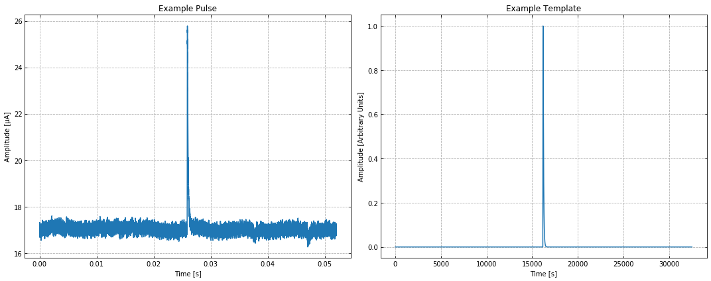
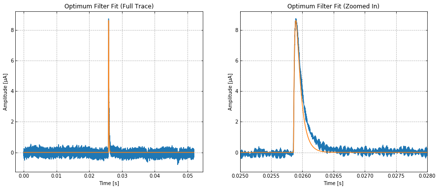

.. raw:: html

   <h1>

Table of Contents

.. raw:: html

   </h1>

.. raw:: html

   

.. raw:: html

   <ul class="toc-item">

.. raw:: html

   </ul>

.. raw:: html

   

Example for Optimum Filter and Nonlinear Pulse Fitting
======================================================

.. code:: ipython3

    import numpy as np
    import matplotlib.pyplot as plt
    %matplotlib inline
    
    from qetpy import ofamp, OFnonlin # Import ofamp and OFnonlin from QETpy

Load saved trace and psd from demos/fitting/

.. code:: ipython3

    psd = np.load('psd.npy')
    pulse = np.load('trace.npy')
    template = np.load('template.npy')
    
    fs = 625e3
    time = np.arange(pulse.shape[-1])/fs

Visualize the pulse and template

.. code:: ipython3

    
    
    fig, ax = plt.subplots(1, 2, figsize=(15,6))
    ax[0].plot(time, pulse*1e6)
    ax[0].grid(True, linestyle = '--')
    ax[0].set_xlabel('Time [s]')
    ax[0].set_ylabel('Amplitude [μA]')
    ax[0].set_title('Example Pulse')
    ax[0].tick_params(which="both", direction="in", right=True, top=True)
    
    
    ax[1].plot(template)
    ax[1].grid(True, linestyle = '--')
    ax[1].set_xlabel('Time [s]')
    ax[1].set_ylabel('Amplitude [Arbitrary Units]')
    ax[1].set_title('Example Template')
    ax[1].tick_params(which="both", direction="in", right=True, top=True)
    
    plt.tight_layout()

Determine the Optimum Filter best fit amplitude

.. code:: ipython3

    ofamp?

We will constrain the OF to only search a window of 100 bins of the
given template. We also use the ``lgcsigma = True`` flag to give us the
estimate theoretical resolution given this template and psd

.. code:: ipython3

    psd.shape

.. parsed-literal::

    (32500,)

.. code:: ipython3

    amp, t0, chi2, sigma = ofamp(signal= pulse, template= template, psd= psd, fs= fs, withdelay= True, 
          lgcsigma= True, nconstrain= 100)

.. code:: ipython3

    print(f'The resolution is: {sigma: .3e} Amps')

.. parsed-literal::

    The resolution is:  2.966e-09 Amps

Visualize the fit

.. code:: ipython3

    fig, ax = plt.subplots(1,2, figsize = (15, 6))
    ax[0].plot(time, (pulse - np.mean(pulse[:10000]))*1e6)
    ax[0].plot(time, amp* np.roll(template, int(t0*fs))*1e6)
    ax[0].set_ylabel('Amplitude [μA]')
    ax[0].set_xlabel('Time [s]')
    ax[0].set_title('Optimum Filter Fit (Full Trace)')
    ax[0].grid(True, linestyle = '--')
    ax[0].tick_params(which="both", direction="in", right=True, top=True)
    
    ax[1].plot(time, (pulse - np.mean(pulse[:10000]))*1e6)
    ax[1].plot(time, amp* np.roll(template, int(t0*fs))*1e6)
    ax[1].set_xlim(.025, .028)
    ax[1].set_ylabel('Amplitude [μA]')
    ax[1].set_xlabel('Time [s]')
    ax[1].set_title('Optimum Filter Fit (Zoomed In)')
    ax[1].grid(True, linestyle = '--')
    ax[1].tick_params(which="both", direction="in", right=True, top=True)

The template doesn't match the pulse very well. Let us now fit the fall
time using ``OFnonlin``

.. code:: ipython3

    OFnonlin?

.. code:: ipython3

    OFnonlin.fit_falltimes?

Use the parameter

``lgcplot = True``

to plot the fit in frequency domain and time domain

.. code:: ipython3

    nonlinof = OFnonlin(psd = psd, fs = 625e3, template=None)
    params, error, _, chi2_nonlin = nonlinof.fit_falltimes(pulse, lgcdouble = True, taurise = 20e-6,
                                                      lgcfullrtn = True, lgcplot = True)

.. image:: pulse_fitting_example_files/pulse_fitting_example_19_0.png

.. code:: ipython3

    print(f'χ^2 per DOF for regular OF: {chi2/pulse.shape[-1]}')
    print(f'χ^2 per DOF for nonlinear OF: {chi2_nonlin}')

.. parsed-literal::

    χ^2 per DOF for regular OF: 66.17069121588709
    χ^2 per DOF for nonlinear OF: 62.565865677997195

