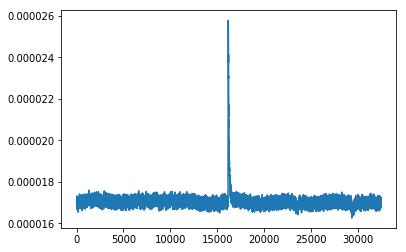
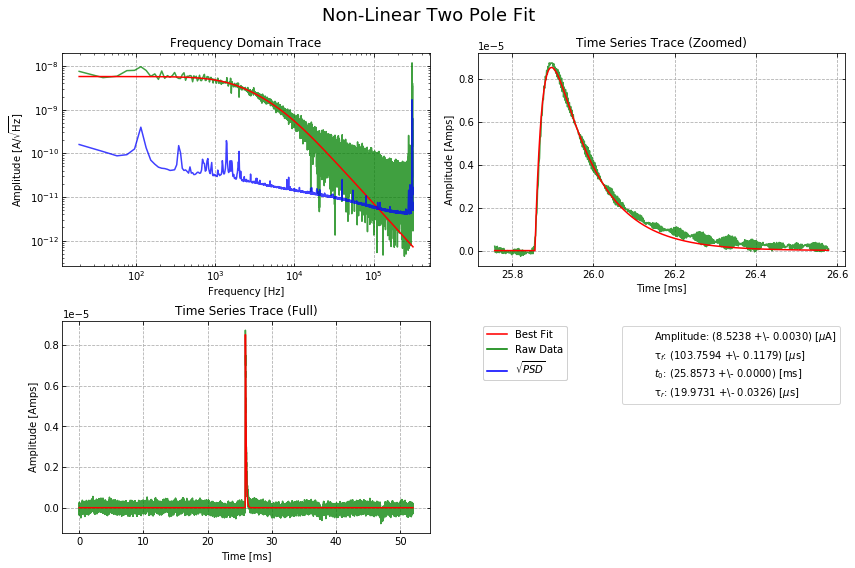

.. raw:: html

   <h1>

Table of Contents

.. raw:: html

   </h1>

.. raw:: html

   

.. raw:: html

   <ul class="toc-item">

.. raw:: html

   </ul>

.. raw:: html

   

Fit fall time and rise time of pulse using OFnonlin
===================================================

.. code:: ipython3

    import numpy as np
    import matplotlib.pyplot as plt
    %matplotlib inline
    
    from qetpy import OFnonlin # Import OFnonlin from QETpy

Load saved trace and psd from demos/fitting/

.. code:: ipython3

    psd = np.load('psd.npy')
    pulse = np.load('trace.npy')

Visualize the pulse

.. code:: ipython3

    plt.plot(pulse)

.. parsed-literal::

    [<matplotlib.lines.Line2D at 0x7f7b78903ba8>]

Fit the rise and fall time using OFnonlin

.. code:: ipython3

    OFnonlin?

.. code:: ipython3

    OFnonlin.fit_falltimes?

Use the parameter

``lgcplot = True``

to plot the fit in frequency domain and time domain

.. code:: ipython3

    nonlinof = OFnonlin(psd = psd, fs = 625e3, template=None)
    params, error, _, chi2 = nonlinof.fit_falltimes(pulse, lgcdouble = True, taurise = 20e-6,
                                                      lgcfullrtn = True, lgcplot = True)

