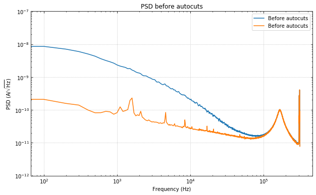

.. raw:: html

   <h1>

Table of Contents

.. raw:: html

   </h1>

.. raw:: html

   

.. raw:: html

   <ul class="toc-item">

.. raw:: html

   </ul>

.. raw:: html

   

Using the ``autocuts`` Algorithm
================================

--------------

This is a quick look at how to use the ``autocuts`` algorithm.

Note that there are many more optional arguments than what are shown
here. For example, you can choose which cuts to do, change the outlier
algorithm used, or indicate that you are cutting on dIdV data.

First, let's import the function.

.. code:: ipython3

    import numpy as np
    import matplotlib.pyplot as plt
    from qetpy import autocuts, calc_psd

Now, let's load the data.

.. code:: ipython3

    pathtodata = "test_autocuts_data.npy"
    traces = np.load(pathtodata)
    fs = 625e3

Let's look at the PSD before the cuts, to get a sense of the change.

.. code:: ipython3

    f, psd = calc_psd(traces, fs=fs, folded_over=True)

.. code:: ipython3

    fig, ax = plt.subplots(figsize=(10,6))
    ax.loglog(f, np.sqrt(psd), label="Before autocuts")
    ax.set_ylim([1e-12,1e-7])
    ax.set_xlabel('Frequency (Hz)')
    ax.set_ylabel('PSD (A/$\sqrt{\mathrm{Hz}}$)')
    ax.set_title("PSD before autocuts")
    ax.legend(loc="upper right")
    ax.grid(linestyle='dotted')
    ax.tick_params(which='both',direction='in',right=True,top=True)

.. image:: test_autocuts_files/test_autocuts_7_0.png

Apply the autocuts function.

.. code:: ipython3

    ?autocuts

.. code:: ipython3

    cut = autocuts(traces, fs=fs)
    print(f"The cut efficiency is {np.sum(cut)/len(traces)}.")

.. parsed-literal::

    The cut efficiency is 0.488.

Let's compare the PSD after the cuts, we should see the noise go down by
a fair amount.

.. code:: ipython3

    psd_cut = calc_psd(traces[cut], fs=fs, folded_over=True)[1]

.. code:: ipython3

    fig, ax = plt.subplots(figsize=(10,6))
    ax.loglog(f, np.sqrt(psd), label="Before autocuts")
    ax.loglog(f, np.sqrt(psd_cut), label="Before autocuts")
    ax.set_ylim([1e-12,1e-7])
    ax.set_xlabel('Frequency (Hz)')
    ax.set_ylabel('PSD (A/$\sqrt{\mathrm{Hz}}$)')
    ax.set_title("PSD before autocuts")
    ax.legend(loc="upper right")
    ax.grid(linestyle='dotted')
    ax.tick_params(which='both',direction='in',right=True,top=True)

The change is huge! Which makes sense, as we have removed many of the
pulses, muon tails, etc. Please note that there may still be "bad"
traces in the data, as the autocuts function is not perfect. There may
be more cuts that one would like to do that are more specific to the
dataset.

