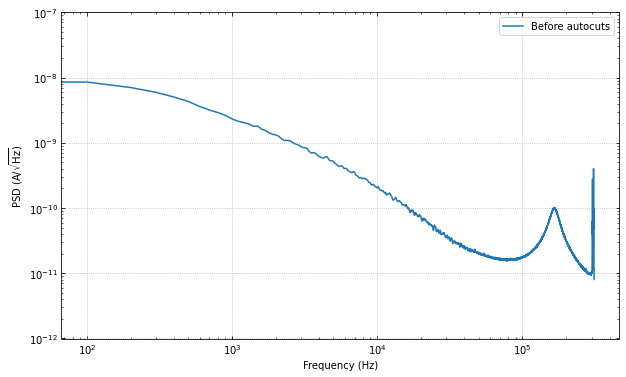
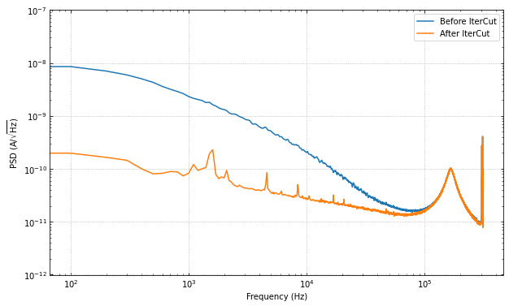
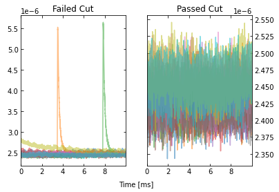
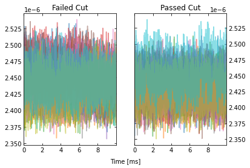
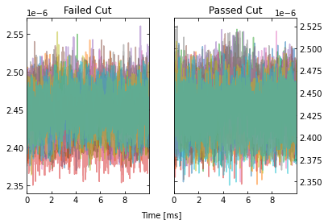
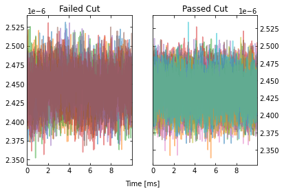
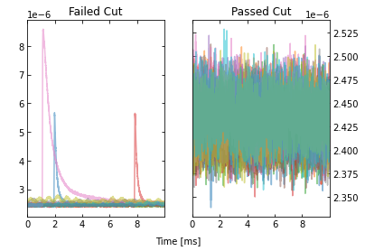
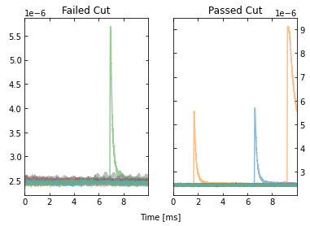
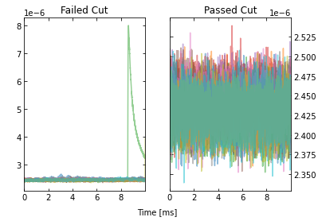

Using the ``autocuts`` and ``IterCut`` Algorithms
=================================================

--------------

This is a quick look at how to use the ``autocuts`` and the ``IterCut``
algorithms. The ``autocuts`` function acts as a black box (the user
cannot see what is going on under the hood), while ``IterCut`` allows
the user to understand each cut being applied to data. For quick
results, ``autocuts`` is usually sufficient, but ``IterCut`` is very
useful to actually understand what is happening.

Note that there are many more optional arguments than what are shown
here in the notebook. As always, we recommend reading the docstrings!

First, let’s import our functions.

.. code:: ipython3

    import numpy as np
    import matplotlib.pyplot as plt
    from qetpy import autocuts, calc_psd, IterCut
    
    # ensure that the notebook is repeatable by using the same random seed
    np.random.seed(1)

Now, let’s load the data.

.. code:: ipython3

    pathtodata = "test_autocuts_data.npy"
    traces = np.load(pathtodata)
    fs = 625e3

Let’s look at the PSD before the cuts, to get a sense of the change.

.. code:: ipython3

    f, psd = calc_psd(traces, fs=fs, folded_over=True)

.. code:: ipython3

    fig, ax = plt.subplots(figsize=(10,6))
    ax.loglog(f, np.sqrt(psd), label="Before autocuts")
    ax.set_ylim([1e-12,1e-7])
    ax.set_xlabel('Frequency (Hz)')
    ax.set_ylabel(r'PSD (A/$\sqrt{\mathrm{Hz}}$)')
    ax.legend(loc="upper right")
    ax.grid(linestyle='dotted')
    ax.tick_params(which='both',direction='in',right=True,top=True)

Using ``autocuts``
------------------

Apply the autocuts function.

.. code:: ipython3

    ?autocuts

.. parsed-literal::

    Function to automatically cut out bad traces based on the optimum
    filter amplitude, slope, baseline, and chi^2 of the traces.
    
    Parameters
    ----------
    traces : ndarray
        2-dimensional array of traces to do cuts on
    fs : float, optional
        Sample rate that the data was taken at
    is_didv : bool, optional
        Boolean flag on whether or not the trace is a dIdV curve
    outlieralgo : string, optional
        Which outlier algorithm to use. If set to "removeoutliers",
        uses the removeoutliers algorithm that removes data based on
        the skewness of the dataset. If set to "iterstat", uses the
        iterstat algorithm to remove data based on being outside a
        certain number of standard deviations from the mean. Can also
        be set to astropy's "sigma_clip".
    lgcpileup1 : boolean, optional
        Boolean value on whether or not do the pileup1 cut (this is the
        initial pileup cut that is always done whether or not we have
        dIdV data). Default is True.
    lgcslope : boolean, optional
        Boolean value on whether or not do the slope cut. Default is
        True.
    lgcbaseline : boolean, optional
        Boolean value on whether or not do the baseline cut. Default is
        True.
    lgcpileup2 : boolean, optional
        Boolean value on whether or not do the pileup2 cut (this cut is
        only done when is_didv is also True). Default is True.
    lgcchi2 : boolean, optional
        Boolean value on whether or not do the chi2 cut. Default is
        True.
    nsigpileup1 : float, optional
        If outlieralgo is "iterstat", this can be used to tune the
        number of standard deviations from the mean to cut outliers
        from the data when using iterstat on the optimum filter
        amplitudes. Default is 2.
    nsigslope : float, optional
        If outlieralgo is "iterstat", this can be used to tune the
        number of standard deviations from the mean to cut outliers
        from the data when using iterstat on the slopes. Default is 2.
    nsigbaseline : float, optional
        If outlieralgo is "iterstat", this can be used to tune the
        number of standard deviations from the mean to cut outliers
        from the data when using iterstat on the baselines. Default is
        2.
    nsigpileup2 : float, optional
        If outlieralgo is "iterstat", this can be used to tune the
        number of standard deviations from the mean to cut outliers
        from the data when using iterstat on the optimum filter
        amplitudes after the mean has been subtracted. (only used if
        is_didv is True). Default is 2.
    nsigchi2 : float, optional
        This can be used to tune the number of standard deviations
        from the mean to cut outliers from the data when using iterstat
        on the chi^2 values. Default is 3.
    **kwargs
        Placeholder kwargs for backwards compatibility.
    
    Returns
    -------
    ctot : ndarray
        Boolean array giving which indices to keep or throw out based
        on the autocuts algorithm.

.. code:: ipython3

    cut = autocuts(
        traces,
        fs=fs,
    )
    print(f"The cut efficiency is {np.sum(cut)/len(traces):.3f}.")

.. parsed-literal::

    The cut efficiency is 0.428.

Let’s compare the PSD after the cuts, we should see the noise go down by
a fair amount.

.. code:: ipython3

    psd_cut = calc_psd(traces[cut], fs=fs, folded_over=True)[1]

.. code:: ipython3

    fig, ax = plt.subplots(figsize=(10,6))
    ax.loglog(f, np.sqrt(psd), label="Before autocuts")
    ax.loglog(f, np.sqrt(psd_cut), label="After autocuts")
    ax.set_ylim([1e-12,1e-7])
    ax.set_xlabel('Frequency (Hz)')
    ax.set_ylabel(r'PSD (A/$\sqrt{\mathrm{Hz}}$)')
    ax.legend(loc="upper right")
    ax.grid(linestyle='dotted')
    ax.tick_params(which='both',direction='in',right=True,top=True)

The change is huge! Which makes sense, as we have removed many of the
pulses, muon tails, etc. Please note that there may still be “bad”
traces in the data, as the autocuts function is not perfect. There may
be more cuts that one would like to do that are more specific to the
dataset.

Using IterCut for better cut control
------------------------------------

A good way of understanding the cuts further than using the black box
that is ``autocuts`` is to use the object-oriented version ``IterCut``.
This class allows the user freedom in cut order, which cuts are used,
which algorithms are used for outlier removal, and more.

Below, we match the default parameters and outlier algorithm
(``iterstat``) to show that the cut efficiency is the same.

.. code:: ipython3

    IC = IterCut(traces, fs)
    IC.pileupcut(cut=2)
    IC.slopecut(cut=2)
    IC.baselinecut(cut=2)
    IC.chi2cut(cut=3)
    cut_ic = IC.cmask

.. code:: ipython3

    print(f"The cut efficiency is {np.sum(cut_ic)/len(traces):.3f}.")

.. parsed-literal::

    The cut efficiency is 0.428.

.. code:: ipython3

    psd_cut = calc_psd(traces[cut_ic], fs=fs, folded_over=True)[1]

.. code:: ipython3

    fig, ax = plt.subplots(figsize=(10,6))
    ax.loglog(f, np.sqrt(psd), label="Before IterCut")
    ax.loglog(f, np.sqrt(psd_cut), label="After IterCut")
    ax.set_ylim([1e-12,1e-7])
    ax.set_xlabel('Frequency (Hz)')
    ax.set_ylabel(r'PSD (A/$\sqrt{\mathrm{Hz}}$)')
    ax.legend(loc="upper right")
    ax.grid(linestyle='dotted')
    ax.tick_params(which='both',direction='in',right=True,top=True)

With ``IterCut`` we can also access the cuts at each step as they have
been iteratively applied, and there is a verbose option for plotting the
passing event and failing events for each cut.

.. code:: ipython3

    IC = IterCut(traces, fs, plotall=True, nplot=10)
    cpileup = IC.pileupcut(cut=2)
    cpileup1 = IC.cmask
    cslope = IC.slopecut(cut=2)
    cbaseline = IC.baselinecut(cut=2)
    cchi2 = IC.chi2cut(cut=3)
    cut_ic = IC.cmask

This allows to calculate the efficiency of each cut, and we can see what
cuts are going the heavy lifting. Note the importance of the denominator
being the number of events that passed the previous cuts when
calculating these efficiencies. If we were to divide by the number of
traces each time, then this would be the total cut efficiency up to that
cut. Below, we show the individual performance of each cut.

.. code:: ipython3

    print(f"The pileup cut efficiency is {np.sum(cpileup)/len(traces):.3f}.")
    print(f"The slope cut efficiency is {np.sum(cslope)/np.sum(cpileup):.3f}.")
    print(f"The baseline cut efficiency is {np.sum(cbaseline)/np.sum(cslope):.3f}.")
    print(f"The chi2 cut efficiency is {np.sum(cchi2)/np.sum(cbaseline):.3f}.")
    print("-------------")
    print(f"The total cut efficiency is {np.sum(cut_ic)/len(traces):.3f}.")

.. parsed-literal::

    The pileup cut efficiency is 0.679.
    The slope cut efficiency is 0.719.
    The baseline cut efficiency is 0.889.
    The chi2 cut efficiency is 0.986.
    -------------
    The total cut efficiency is 0.428.

Thus, we see that the pileup cut is has the lowest efficiency, with the
slope cut as a close second. If we were to remove the baseline and
chi-squared cuts, then we would expect the PSD to not change noticeably.
Let’s test this expectation.

Note that we can also plot the events passing/failing a specific cut by
passing ``verbose=True``, as shown below.

.. code:: ipython3

    IC = IterCut(traces, fs)
    cpileup = IC.pileupcut(cut=2, verbose=True)
    cslope = IC.slopecut(cut=2)
    cut_ic = IC.cmask

.. code:: ipython3

    print(f"The pileup cut efficiency is {np.sum(cpileup)/len(traces):.3f}.")
    print(f"The slope cut efficiency is {np.sum(cslope)/np.sum(cpileup):.3f}.")
    print("-------------")
    print(f"The total cut efficiency is {np.sum(cut_ic)/len(traces):.3f}.")

.. parsed-literal::

    The pileup cut efficiency is 0.679.
    The slope cut efficiency is 0.719.
    -------------
    The total cut efficiency is 0.488.

.. code:: ipython3

    psd_cut = calc_psd(traces[cut_ic], fs=fs, folded_over=True)[1]

.. code:: ipython3

    fig, ax = plt.subplots(figsize=(10,6))
    ax.loglog(f, np.sqrt(psd), label="Before IterCut")
    ax.loglog(f, np.sqrt(psd_cut), label="After IterCut")
    ax.set_ylim([1e-12,1e-7])
    ax.set_xlabel('Frequency (Hz)')
    ax.set_ylabel(r'PSD (A/$\sqrt{\mathrm{Hz}}$)')
    ax.legend(loc="upper right")
    ax.grid(linestyle='dotted')
    ax.tick_params(which='both',direction='in',right=True,top=True)

What if we reversed the cut order? How does this affect the cut
efficiencies?

.. code:: ipython3

    IC = IterCut(traces, fs, plotall=False)
    cchi2 = IC.chi2cut(cut=3)
    cbaseline = IC.baselinecut(cut=2)
    cslope = IC.slopecut(cut=2)
    cpileup = IC.pileupcut(cut=2)
    cut_ic = IC.cmask

.. code:: ipython3

    print(f"The chi2 cut efficiency is {np.sum(cchi2)/len(traces):.3f}.")
    print(f"The baseline cut efficiency is {np.sum(cbaseline)/np.sum(cchi2):.3f}.")
    print(f"The slope cut efficiency is {np.sum(cslope)/np.sum(cbaseline):.3f}.")
    print(f"The pileup cut efficiency is {np.sum(cpileup)/np.sum(cslope):.3f}.")
    print("-------------")
    print(f"The total cut efficiency is {np.sum(cut_ic)/len(traces):.3f}.")

.. parsed-literal::

    The chi2 cut efficiency is 0.840.
    The baseline cut efficiency is 0.739.
    The slope cut efficiency is 0.718.
    The pileup cut efficiency is 0.706.
    -------------
    The total cut efficiency is 0.315.

.. code:: ipython3

    psd_cut = calc_psd(traces[cut_ic], fs=fs, folded_over=True)[1]

.. code:: ipython3

    fig, ax = plt.subplots(figsize=(10,6))
    ax.loglog(f, np.sqrt(psd), label="Before IterCut")
    ax.loglog(f, np.sqrt(psd_cut), label="After IterCut")
    ax.set_ylim([1e-12,1e-7])
    ax.set_xlabel('Frequency (Hz)')
    ax.set_ylabel(r'PSD (A/$\sqrt{\mathrm{Hz}}$)')
    ax.legend(loc="upper right")
    ax.grid(linestyle='dotted')
    ax.tick_params(which='both',direction='in',right=True,top=True)

The PSD is essentially the same, but the pileup cut is no longer doing
much, as we did it last (the previous three cuts ended cutting out a lot
of pileup!). Thus, this shows that order does matter, and its worth
thinking about what order makes the most sense in one’s application.

Advanced Usage: Arbitrary Cuts
------------------------------

For advanced users, ``IterCut`` includes an option to apply some
arbitrary cut based on some function that isn’t included by default (or
some one-off user-defined function). As an example, let’s add a maximum
cut via ``numpy.max``, but only finding the maximum up to some specified
bin number in the trace.

.. code:: ipython3

    maximum = lambda traces, end_index: np.max(traces[..., :end_index], axis=-1)

.. code:: ipython3

    IC = IterCut(traces, fs, plotall=True)
    cmaximum = IC.arbitrarycut(maximum, 200, cut=2)
    cpileup = IC.pileupcut(cut=2)
    cslope = IC.slopecut(cut=2)
    cut_ic = IC.cmask

.. image:: test_autocuts_files/test_autocuts_34_2.png

.. code:: ipython3

    print(f"The maximum cut efficiency is {np.sum(cmaximum)/len(traces):.3f}.")
    print(f"The pileup cut efficiency is {np.sum(cpileup)/np.sum(cmaximum):.3f}.")
    print(f"The slope cut efficiency is {np.sum(cslope)/np.sum(cpileup):.3f}.")
    print("-------------")
    print(f"The total cut efficiency is {np.sum(cut_ic)/len(traces):.3f}.")

.. parsed-literal::

    The maximum cut efficiency is 0.721.
    The pileup cut efficiency is 0.742.
    The slope cut efficiency is 0.763.
    -------------
    The total cut efficiency is 0.408.

Looking at the events that passed, we see that the maximum cut we
applied allowed a “bad” trace (a trace with a pulse). This makes sense
since we only looked at a portion of the trace for that cut, so it was
not a very good cut. Fortunately, our pileup and slope cuts did a good
job of removing the bad traces that passed the maximum cut.

Lastly, it’s worth simply printing out the docstrings of the three
different supported outlier algorithms. The ``kwargs`` vary considerably
between each of them, so to specify them in ``IterCut``, one must know
which ones to use! For example, ``iterstat`` has the ``cut`` ``kwarg``,
which we were using in the above examples (because ``iterstat`` is the
default outlier algorithm for these automated cut routines).

.. code:: ipython3

    from qetpy.cut import iterstat, removeoutliers
    from astropy.stats import sigma_clip

.. code:: ipython3

    ?iterstat

.. parsed-literal::

    Function to iteratively remove outliers based on how many standard
    deviations they are from the mean, where the mean and standard
    deviation are recalculated after each cut.
    
    Parameters
    ----------
    data : ndarray
        Array of data that we want to remove outliers from.
    cut : float, optional
        Number of standard deviations from the mean to be used for
        outlier rejection
    precision : float, optional
        Threshold for change in mean or standard deviation such that we
        stop iterating. The threshold is determined by
        np.std(data)/precision. This means that a higher number for
        precision means a lower threshold (i.e. more iterations).
    return_unbiased_estimates : bool, optional
        Boolean flag for whether or not to return the biased or
        unbiased estimates of the mean and standard deviation of the
        data. Default is False.
    
    Returns
    -------
    datamean : float
        Mean of the data after outliers have been removed.
    datastd : float
        Standard deviation of the data after outliers have been
        removed.
    datamask : ndarray
        Boolean array indicating which values to keep or reject in
        data, same length as data.

.. code:: ipython3

    ?removeoutliers

.. parsed-literal::

    Function to return indices of inlying points, removing points
    by minimizing the skewness.
    
    Parameters
    ----------
    x : ndarray
        Array of real-valued variables from which to remove outliers.
    maxiter : float, optional
        Maximum number of iterations to continue to minimize skewness.
        Default is 20.
    skewtarget : float, optional
        Desired residual skewness of distribution. Default is 0.05.
    
    Returns
    -------
    inds : ndarray
        Boolean indices indicating which values to select/reject, same
        length as `x`.

.. code:: ipython3

    ?sigma_clip

.. parsed-literal::

    Perform sigma-clipping on the provided data.
    
    The data will be iterated over, each time rejecting values that are
    less or more than a specified number of standard deviations from a
    center value.
    
    Clipped (rejected) pixels are those where::
    
        data < center - (sigma_lower * std)
        data > center + (sigma_upper * std)
    
    where::
    
        center = cenfunc(data [, axis=])
        std = stdfunc(data [, axis=])
    
    Invalid data values (i.e., NaN or inf) are automatically clipped.
    
    For an object-oriented interface to sigma clipping, see
    :class:`SigmaClip`.
    
    .. note::
        `scipy.stats.sigmaclip` provides a subset of the functionality
        in this class. Also, its input data cannot be a masked array
        and it does not handle data that contains invalid values (i.e.,
        NaN or inf). Also note that it uses the mean as the centering
        function. The equivalent settings to `scipy.stats.sigmaclip`
        are::
    
            sigma_clip(sigma=4., cenfunc='mean', maxiters=None, axis=None,
            ...        masked=False, return_bounds=True)
    
    Parameters
    ----------
    data : array-like or `~numpy.ma.MaskedArray`
        The data to be sigma clipped.
    
    sigma : float, optional
        The number of standard deviations to use for both the lower
        and upper clipping limit. These limits are overridden by
        ``sigma_lower`` and ``sigma_upper``, if input. The default is 3.
    
    sigma_lower : float or None, optional
        The number of standard deviations to use as the lower bound for
        the clipping limit. If `None` then the value of ``sigma`` is
        used. The default is `None`.
    
    sigma_upper : float or None, optional
        The number of standard deviations to use as the upper bound for
        the clipping limit. If `None` then the value of ``sigma`` is
        used. The default is `None`.
    
    maxiters : int or None, optional
        The maximum number of sigma-clipping iterations to perform or
        `None` to clip until convergence is achieved (i.e., iterate
        until the last iteration clips nothing). If convergence is
        achieved prior to ``maxiters`` iterations, the clipping
        iterations will stop. The default is 5.
    
    cenfunc : {'median', 'mean'} or callable, optional
        The statistic or callable function/object used to compute
        the center value for the clipping. If using a callable
        function/object and the ``axis`` keyword is used, then it must
        be able to ignore NaNs (e.g., `numpy.nanmean`) and it must have
        an ``axis`` keyword to return an array with axis dimension(s)
        removed. The default is ``'median'``.
    
    stdfunc : {'std', 'mad_std'} or callable, optional
        The statistic or callable function/object used to compute the
        standard deviation about the center value. If using a callable
        function/object and the ``axis`` keyword is used, then it must
        be able to ignore NaNs (e.g., `numpy.nanstd`) and it must have
        an ``axis`` keyword to return an array with axis dimension(s)
        removed. The default is ``'std'``.
    
    axis : None or int or tuple of int, optional
        The axis or axes along which to sigma clip the data. If `None`,
        then the flattened data will be used. ``axis`` is passed to the
        ``cenfunc`` and ``stdfunc``. The default is `None`.
    
    masked : bool, optional
        If `True`, then a `~numpy.ma.MaskedArray` is returned, where
        the mask is `True` for clipped values. If `False`, then a
        `~numpy.ndarray` and the minimum and maximum clipping thresholds
        are returned. The default is `True`.
    
    return_bounds : bool, optional
        If `True`, then the minimum and maximum clipping bounds are also
        returned.
    
    copy : bool, optional
        If `True`, then the ``data`` array will be copied. If `False`
        and ``masked=True``, then the returned masked array data will
        contain the same array as the input ``data`` (if ``data`` is a
        `~numpy.ndarray` or `~numpy.ma.MaskedArray`). If `False` and
        ``masked=False``, the input data is modified in-place. The
        default is `True`.
    
    grow : float or `False`, optional
        Radius within which to mask the neighbouring pixels of those
        that fall outwith the clipping limits (only applied along
        ``axis``, if specified). As an example, for a 2D image a value
        of 1 will mask the nearest pixels in a cross pattern around each
        deviant pixel, while 1.5 will also reject the nearest diagonal
        neighbours and so on.
    
    Returns
    -------
    result : array-like
        If ``masked=True``, then a `~numpy.ma.MaskedArray` is returned,
        where the mask is `True` for clipped values and where the input
        mask was `True`.
    
        If ``masked=False``, then a `~numpy.ndarray` is returned.
    
        If ``return_bounds=True``, then in addition to the masked array
        or array above, the minimum and maximum clipping bounds are
        returned.
    
        If ``masked=False`` and ``axis=None``, then the output array
        is a flattened 1D `~numpy.ndarray` where the clipped values
        have been removed. If ``return_bounds=True`` then the returned
        minimum and maximum thresholds are scalars.
    
        If ``masked=False`` and ``axis`` is specified, then the output
        `~numpy.ndarray` will have the same shape as the input ``data``
        and contain ``np.nan`` where values were clipped. If the input
        ``data`` was a masked array, then the output `~numpy.ndarray`
        will also contain ``np.nan`` where the input mask was `True`.
        If ``return_bounds=True`` then the returned minimum and maximum
        clipping thresholds will be be `~numpy.ndarray`\s.
    
    See Also
    --------
    SigmaClip, sigma_clipped_stats
    
    Notes
    -----
    The best performance will typically be obtained by setting
    ``cenfunc`` and ``stdfunc`` to one of the built-in functions
    specified as as string. If one of the options is set to a string
    while the other has a custom callable, you may in some cases see
    better performance if you have the `bottleneck`_ package installed.
    
    .. _bottleneck:  https://github.com/pydata/bottleneck
    
    Examples
    --------
    This example uses a data array of random variates from a Gaussian
    distribution. We clip all points that are more than 2 sample
    standard deviations from the median. The result is a masked array,
    where the mask is `True` for clipped data::
    
        >>> from astropy.stats import sigma_clip
        >>> from numpy.random import randn
        >>> randvar = randn(10000)
        >>> filtered_data = sigma_clip(randvar, sigma=2, maxiters=5)
    
    This example clips all points that are more than 3 sigma relative
    to the sample *mean*, clips until convergence, returns an unmasked
    `~numpy.ndarray`, and does not copy the data::
    
        >>> from astropy.stats import sigma_clip
        >>> from numpy.random import randn
        >>> from numpy import mean
        >>> randvar = randn(10000)
        >>> filtered_data = sigma_clip(randvar, sigma=3, maxiters=None,
        ...                            cenfunc=mean, masked=False, copy=False)
    
    This example sigma clips along one axis::
    
        >>> from astropy.stats import sigma_clip
        >>> from numpy.random import normal
        >>> from numpy import arange, diag, ones
        >>> data = arange(5) + normal(0., 0.05, (5, 5)) + diag(ones(5))
        >>> filtered_data = sigma_clip(data, sigma=2.3, axis=0)
    
    Note that along the other axis, no points would be clipped, as the
    standard deviation is higher.

