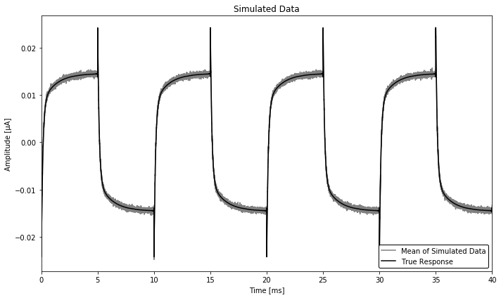
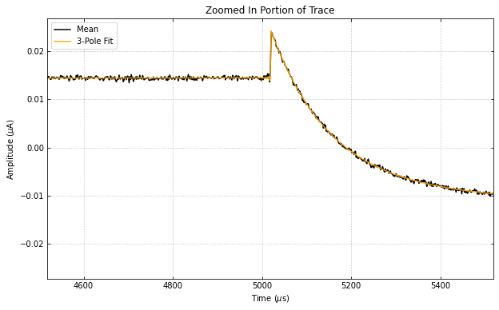
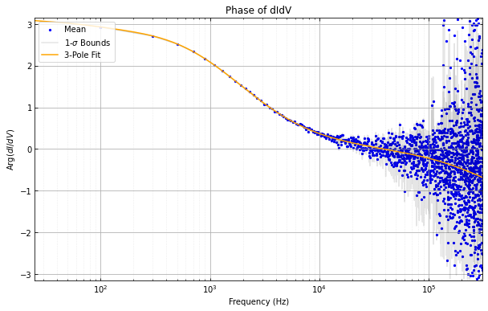

Example Code for using the :math:`\partial I/ \partial V` Fitting Routines
==========================================================================

Import the needed packages to run the test script.

.. code:: ipython3

    import qetpy as qp
    import matplotlib.pyplot as plt
    import numpy as np
    
    np.random.seed(0)
    
    %matplotlib inline

Set all of the necessary parameters for initalizing the class, as well
as specify the TES parameters that we will use to simulate a TES square
wave response.

.. code:: ipython3

    # Setting various parameters that are specific to the dataset
    rsh = 5e-3
    rbias_sg = 20000
    fs = 625e3
    sgfreq = 100
    sgamp = 0.009381 / rbias_sg
    
    rfb = 5000
    loopgain = 2.4
    drivergain = 4
    adcpervolt = 65536 / 2
    tracegain = rfb * loopgain * drivergain * adcpervolt
    
    true_params = {
        'rsh': rsh,
        'rp': 0.006,
        'r0': 0.0756,
        'beta': 2,
        'l': 10,
        'L': 1e-7,
        'tau0': 500e-6,
        'gratio': 0.5,
        'tau3': 1e-3,
    }

Make simulated data, where we simply have a TES square response with
added white noise (not exactly physical, but this is just a demo!).

.. code:: ipython3

    psd_test = np.ones(int(4 * fs / sgfreq)) / tracegain**2 / 1e4
    rawnoise = qp.gen_noise(psd_test, fs=fs, ntraces=300)

.. code:: ipython3

    t = np.arange(rawnoise.shape[-1]) / fs
    didv_response = qp.squarewaveresponse(
        t, sgamp, sgfreq, **true_params,
    )
    rawtraces = didv_response + rawnoise

.. code:: ipython3

    fig, ax = plt.subplots(figsize=(10, 6))
    ax.plot(
        t * 1e3,
        rawtraces.mean(axis=0) * 1e6,
        color='gray',
        label='Mean of Simulated Data',
    )
    ax.plot(
        t * 1e3,
        didv_response * 1e6,
        color='k',
        label='True Response',
    )
    ax.set_ylabel('Amplitude [μA]')
    ax.set_xlabel('Time [ms]')
    ax.set_title('Simulated Data')
    ax.set_xlim(0, 40)
    ax.legend(loc='lower right', edgecolor='k', framealpha=1)
    fig.tight_layout()

Using the ``DIDV`` Class
------------------------

Run the processing package on the data.

Note that the parameterization used by this class is such that there are
no degenerate fitting parameters. Depending on the fit, the model
changes.

From the Notes in ``DIDV.dofit``:

::

    Notes
    -----
    Depending on the fit, there are three possible models to be
    used with different parameterizations:

    1-pole model
        - has the form:
            dV/dI = A * (1.0 + 2.0j * pi * freq * tau2)

    2-pole model
        - has the form:
            dV/dI = A * (1.0 + 2.0j * pi * freq * tau2)
                  + B / (1.0 + 2.0j * pi * freq * tau1)

    3-pole model
        - note the placement of the parentheses in the last term of
          this model, such that pole related to `C` is in the
          denominator of the `B` term
        - has the form: 
            dV/dI = A * (1.0 + 2.0j * pi * freq * tau2)
                  + B / (1.0 + 2.0j * pi * freq * tau1
                  - C / (1.0 + 2.0j * pi * freq * tau3))

.. code:: ipython3

    didvfit = qp.DIDV(
        rawtraces,
        fs,
        sgfreq,
        sgamp,
        rsh,
        tracegain=1.0,
        r0=true_params['r0'], # the expected r0 should be specified if the estimated small-signal parameters are desired (otherwise they will be nonsensical)
        rp=true_params['rp'], # the expected rp should be specified if the estimated small-signal parameters are desired (otherwise they will be nonsensical)
        dt0=-1e-6, # a good estimate of the time shift value will likely speed up the fit/improve accuracy
        add180phase=False, # if the fits aren't working, set this to True to see if the square wave is off by half a period
    )
    
    # didvfit.dofit(1) # we skip the 1-pole fit, as it takes a long time to run due to being a bad model.
    didvfit.dofit(2)
    didvfit.dofit(3)

Let's look at the fit parameters for the fits.

.. code:: ipython3

    result2 = didvfit.fitresult(2)
    result3 = didvfit.fitresult(3)

Each of these ``result`` variables are dictionaries that contain various
information that have to do with the fits, as shown by looking at the
keys.

.. code:: ipython3

    result3.keys()

.. parsed-literal::

    dict_keys(['params', 'cov', 'errors', 'falltimes', 'cost', 'smallsignalparams'])

-  ``'params'`` contains the fitted parameters from the minimization
   method (in the case of ``DIDV``, this is in the parameterization used
   by the fitting algorithm)
-  ``'cov'`` contains the corresponding covariance matrix
-  ``'errors'`` is simply the square root of the diagonal of the
   covariance matrix
-  ``'falltimes'`` contains the physical fall times of the specified
   model
-  ``'cost'`` is the value of the chi-square at the fitted values
-  ``'smallsignalparams'`` contains the corresponding parameters in the
   small-signal parameterization of the complex impedance, as shown by
   `Irwin and Hilton <https://doi.org/10.1007/10933596_3>`__ for the
   two-pole model and `Maasilta <https://doi.org/10.1063/1.4759111>`__
   for the three-pole model.

We can also use ``qetpy.complexadmittance`` along with the
``'smallsignalparams'`` dictionary to quickly calculate the
zero-frequency component of the :math:`\partial I / \partial V`.

.. code:: ipython3

    print(f"The 2-pole dI/dV(0) is: {qp.complexadmittance(0, **result2['smallsignalparams']).real:.2f}")
    print(f"The 3-pole dI/dV(0) is: {qp.complexadmittance(0, **result3['smallsignalparams']).real:.2f}")

.. parsed-literal::

    The 2-pole dI/dV(0) is: -11.61
    The 3-pole dI/dV(0) is: -12.43

There are a handful of plotting functions that can be used to plot the
results, where we use two of them below.

.. code:: ipython3

    # didvfit.plot_full_trace()
    # didvfit.plot_single_period_of_trace()
    # didvfit.plot_didv_flipped()
    # didvfit.plot_re_vs_im_didv()
    # didvfit.plot_re_im_didv()
    
    fig, ax = didvfit.plot_zoomed_in_trace(zoomfactor=0.1)
    ax.legend(loc='upper right')
    # fig, ax = didvfit.plot_abs_phase_didv()

.. image:: test_didv_files/test_didv_19_0.png

.. parsed-literal::

    <matplotlib.legend.Legend at 0x7fe5fe695198>

Advanced Usage: Using ``DIDVPriors``
------------------------------------

There is a separate class, which uses the small-signal parameterization
to do the fitting. However, the small-signal parameterization has more
parameters than degrees of freedom, resulting in degeneracy in the model
(as opposed to the models used by ``DIDV``, which are non-degenerate).
However, if the uncertainties on the small-signal parameters are
desired, then the ``DIDVPriors`` class is recommended, which uses a
prior probability distribution on known values to remove the
degeneracies.

The initialization of the class is quite similar.

.. code:: ipython3

    didvfitprior = qp.DIDVPriors(
        rawtraces,
        fs,
        sgfreq,
        sgamp,
        rsh,
        tracegain=1.0,
        dt0=-18.8e-6,
    )

Running the fit requires more information, as we need to know the prior
probability distribution. In this case, ``priors`` and ``priorscov`` are
additionally required in the ``dofit`` method.

-  ``priors`` is a 1-d ndarray that contains the prior known values of
   the specified model.
-  ``priorscov`` is a 2-d ndarray that contains the corresponding
   covariance matrix of the values in ``priors``

   -  For any values that are not known, the corresponding elements
      should be set to zero for both ``priors`` and ``priorscov``.

The values of ``priors`` and ``priorscov`` for each model are: - 1-pole
- ``priors`` is a 1-d array of length 4 containing (``rsh``, ``rp``,
``L``, ``dt``) **(in that order!)** - ``priorscov`` is a 2-d array of
shape (4, 4) containing the corresponding covariance matrix - 2-pole -
``priors`` is a 1-d array of length 8 containing (``rsh``, ``rp``,
``r0``, ``beta``, ``l``, ``L``, ``tau0``, ``dt``) **(in that order!)** -
``priorscov`` is a 2-d array of shape (8, 8) containing the
corresponding covariance matrix - 1-pole - ``priors`` is a 1-d array of
length 10 containing (``rsh``, ``rp``, ``r0``, ``beta``, ``l``, ``L``,
``tau0``, ``gratio``, ``tau3``, ``dt``) **(in that order!)** -
``priorscov`` is a 2-d array of shape (10, 10) containing the
corresponding covariance matrix

We note that, the more parameters passed to the fitting algorithm, the
'better' the result will be, as degeneracies will be removed.

At minimum, we recommend passing ``rsh``, ``rp``, and ``r0`` (the last
of which should not be passed to the 1-pole fit).

Below, we show an example of using the fitting algorithm for the 3-pole
case, assuming 10% errors on ``rsh``, ``rp``, and ``r0``.

.. code:: ipython3

    priors = np.zeros(10)
    priorscov = np.zeros((10, 10))
    
    priors[0] = true_params['rsh']
    priorscov[0, 0] = (0.1 * priors[0])**2
    priors[1] = true_params['rp']
    priorscov[1, 1] = (0.1 * priors[1])**2
    priors[2] = true_params['r0']
    priorscov[2, 2] = (0.1 * priors[2])**2
    
    didvfitprior.dofit(3, priors, priorscov)

Extracting the results of the fit is very similar, where a dictionary is
returned, which has slightly different form than ``DIDV``.

.. code:: ipython3

    result3_priors = didvfitprior.fitresult(3)
    result3_priors.keys()

.. parsed-literal::

    dict_keys(['params', 'cov', 'errors', 'falltimes', 'cost', 'priors', 'priorscov'])

-  ``'params'`` contains the fitted parameters from the minimization
   method (which are the small-signal parameters), as shown by `Irwin
   and Hilton <https://doi.org/10.1007/10933596_3>`__ for the two-pole
   model and `Maasilta <https://doi.org/10.1063/1.4759111>`__ for the
   three-pole model.
-  ``'cov'`` contains the corresponding covariance matrix
-  ``'errors'`` is simply the square root of the diagonal of the
   covariance matrix
-  ``'falltimes'`` contains the physical fall times of the specified
   model
-  ``'cost'`` is the value of the chi-square at the fitted values
-  ``'priors'`` simply contains the inputted priors
-  ``'priorscov'`` simply contains the inputted priors covariance matrix

Note the lack of ``smallsignalparams``, as compared to ``DIDV``. Since
we fit directly using the small-signal parameterization, there is no
need to convert parameters.

We can again calculate the zero-frequency component of the
:math:`\partial I / \partial V` using ``qetpy.complexadmittance``, this
time using the ``'params'`` key in the results dictionary.

.. code:: ipython3

    print(f"The 3-pole dI/dV(0) is: {qp.complexadmittance(0, **result3_priors['params']).real:.2f}")

.. parsed-literal::

    The 3-pole dI/dV(0) is: -12.43

This class uses the same plotting functions as ``DIDV``, such that they
can be called in the same way.

.. code:: ipython3

    didvfitprior.plot_zoomed_in_trace(zoomfactor=0.1)
    didvfitprior.plot_abs_phase_didv()

.. image:: test_didv_files/test_didv_31_1.png

