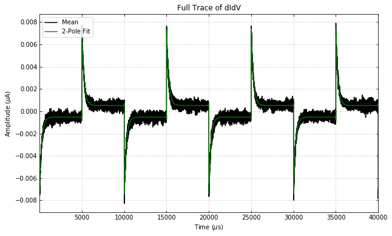
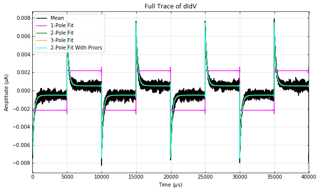
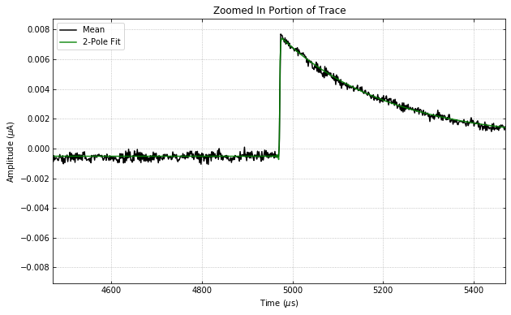
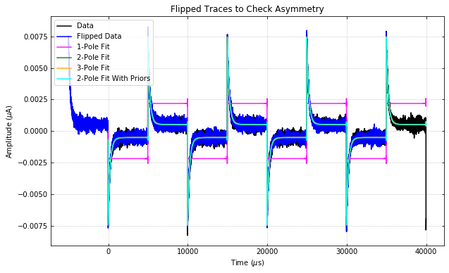
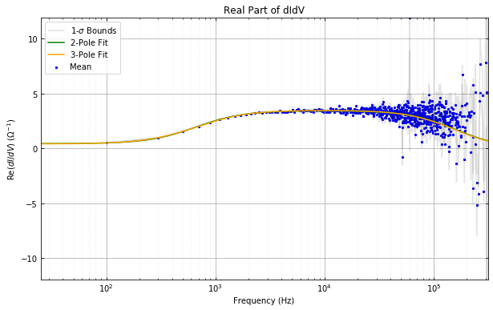
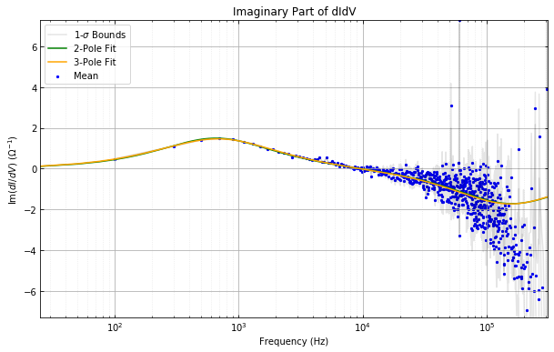
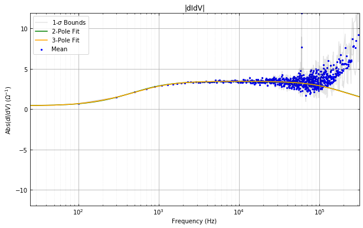
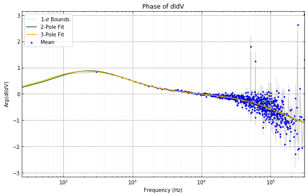

.. raw:: html

   <h1>

Table of Contents

.. raw:: html

   </h1>
   
<ul class="toc-item"></ul>

Example Code for using the DIDV class
=====================================

Import the needed packages to run the test script.

.. code:: ipython3

    from qetpy import DIDV
    import matplotlib.pyplot as plt
    import numpy as np
    import h5py
    
    %matplotlib inline

Set all of the necessary parameters and load the traces from an HDF5
file in the repository.

.. code:: ipython3

    # Setting various parameters that are specific to the dataset
    rshunt = 5e-3
    rbias_sg = 20000
    rfb = 5000
    loopgain = 2.4
    adcpervolt = 65536 / 2
    fs = 625e3
    sgfreq = 100
    sgamp = 0.009381 / rbias_sg
    drivergain = 4
    rp = 0.0060367199999999998
    rload = rshunt + rp
    drload = 0.0001
    r0 = 0.075570107054005367
    dr0 = 8.96383052e-04
    
    convtoamps = rfb * loopgain * drivergain * adcpervolt
    
    # load the dataset
    with h5py.File('example_traces.h5','r') as f:
        rawtraces = np.array(f["rawTraces"])
    
    # set the priors information, for use the priors fitting
    priors = np.zeros(7)
    invpriorscov = np.zeros((7,7))
    priors[0] = rload
    priors[1] = r0
    invpriorscov[0, 0] = 1 / drload**2
    invpriorscov[1, 1] = 1 / dr0**2
    dt0 = -18.8e-6

Run the processing package on the data.

.. code:: ipython3

    didvfit = DIDV(
        rawtraces,
        fs,
        sgfreq,
        sgamp,
        rshunt,
        r0=r0,
        r0_err=dr0,
        rload=rload,
        rload_err=drload,
        tracegain=convtoamps,
    #     priors=priors, # uncomment this and the below line to be able to run the priors fit
    #     invpriorscov=invpriorscov,
        dt0=dt0, # use dt0 to set the expected time shift, should be set if it is expected to be far from zero.
    )
    
    # note that there are many more attributes for DIDV
    
    didvfit.processtraces()
    didvfit.doallfits()
    # didvfit.dofit(2) # just do one fit
    didvfit.plot_full_trace(poles=2, plotpriors=False)

Let's look at the fit parameters for the 2-pole fit.

.. code:: ipython3

    didvfit.fitparams2

.. parsed-literal::

    array([ 2.91338754e-01,  1.96261181e+00,  1.87362036e-03,  9.97944582e-07,
           -1.88710800e-05])

.. code:: ipython3

    didvfit.irwinparams2

.. parsed-literal::

    array([ 1.10367200e-02,  7.55701071e-02,  2.70916550e+00,  8.46506532e-01,
            2.90739931e-07,  2.87588485e-04, -1.88710800e-05])

.. code:: ipython3

    didvfit.get_irwinparams_dict(2)

.. parsed-literal::

    {'rload': 0.01103672,
     'r0': 0.07557010705400537,
     'beta': 2.709165495861126,
     'l': 0.8465065323458877,
     'L': 2.907399307646422e-07,
     'tau0': 0.00028758848545007545,
     'dt': -1.8871080032829034e-05,
     'tau_eff': 0.00024130587314179404}

Let's see what dIdV(0) is.

.. code:: ipython3

    didvfit.didvfit2_freqdomain[0].real

.. parsed-literal::

    0.4436654547653433

What are the fall times?

.. code:: ipython3

    didvfit.falltimes2

.. parsed-literal::

    array([1.00155315e-06, 2.41305873e-04])

Let's play with the plotting functions available.

Let's first plot all of this fits on the full trace.

.. code:: ipython3

    didvfit.plot_full_trace(poles="all", plotpriors=False)

Now let's plot a single trace and save the file to the current
directory. If a different directory is wanted, then use the ``savepath``
variable.

.. code:: ipython3

    didvfit.plot_single_period_of_trace(poles=[2, 3], lgcsave=True, savename="test", plotpriors=False)

Let's plot a zoomed in trace of just the 2 pole fit. Note that by
default, all fits are plotted.

.. code:: ipython3

    didvfit.plot_zoomed_in_trace(poles=2, plotpriors=False)

Let's flip the trace and shift it by half a period of the signal
generator in order to see if there are any nonlinearities. Spoilter
alert: there aren't!

.. code:: ipython3

    didvfit.plot_didv_flipped()

Now let's look at the real and imaginary parts of the dIdV.

.. code:: ipython3

    didvfit.plot_re_im_didv(poles=[2, 3], plotpriors=False)

Alternatively, we can look at the absolute value and the phase of the
dIdV.

.. code:: ipython3

    didvfit.plot_abs_phase_didv(poles=[2, 3], plotpriors=False)

